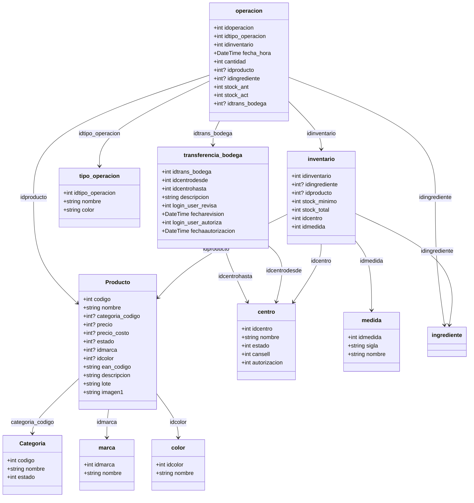
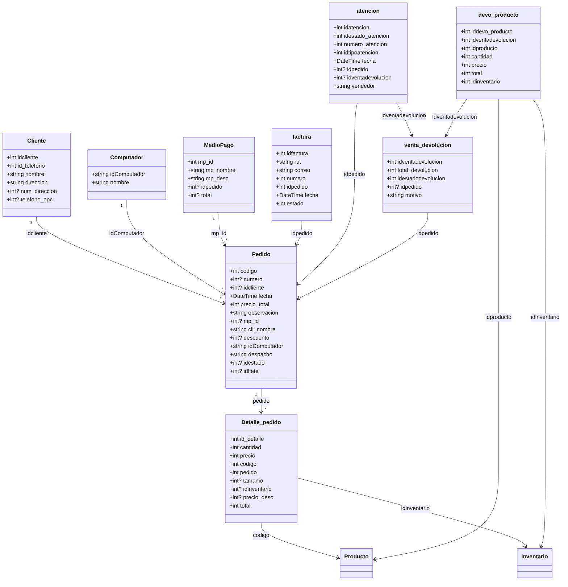
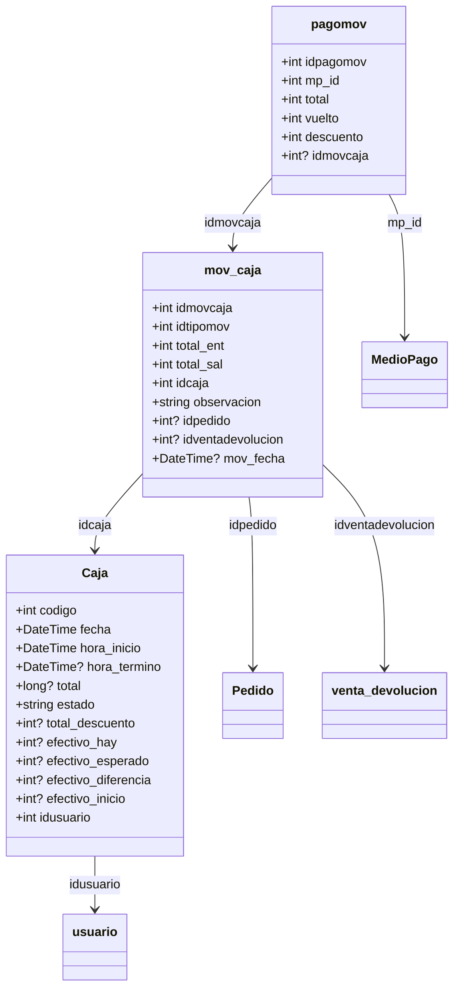
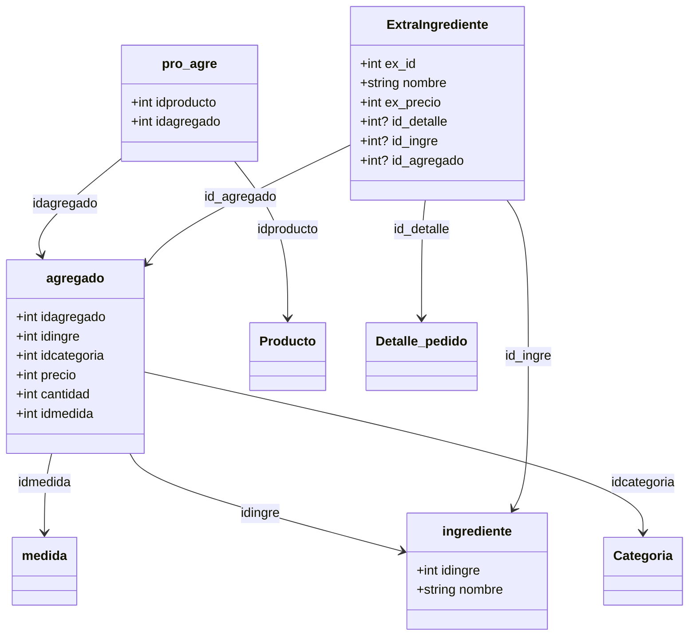
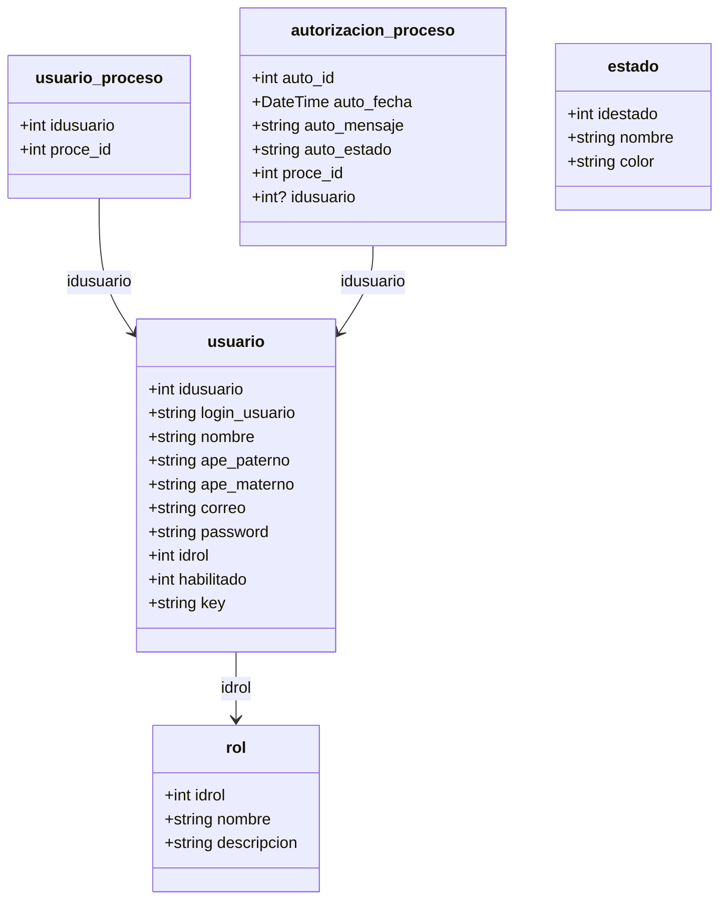

# Diagrama completo de entidades

Este documento resume las entidades del proyecto `Erp/Model`, sus propiedades principales y relaciones inferidas desde claves, nombres de campos y propiedades `virtual`.

Contexto EF: `Erp/Model/ModelDataBase.cs`

## DbSet registrados

| DbSet | Entidad |
| --- | --- |
| `Caja` | `Caja` |
| `Categoria` | `Categoria` |
| `Cliente` | `Cliente` |
| `Computador` | `Computador` |
| `Detalle_pedido` | `Detalle_pedido` |
| `MedioPago` | `MedioPago` |
| `Pedido` | `Pedido` |
| `Producto` | `Producto` |
| `agregado` | `agregado` |
| `pro_agre` | `pro_agre` |
| `medida` | `medida` |
| `centro` | `centro` |
| `inventario` | `inventario` |
| `operacion` | `operacion` |
| `estado` | `estado` |
| `rol` | `rol` |
| `usuario` | `usuario` |
| `marca` | `marca` |
| `color` | `color` |
| `mov_caja` | `mov_caja` |
| `pagomov` | `pagomov` |
| `venta_devolucion` | `venta_devolucion` |
| `atencion` | `atencion` |
| `devo_producto` | `devo_producto` |
| `transferencia_bodega` | `transferencia_bodega` |
| `usuario_proceso` | `usuario_proceso` |
| `autorizacion_proceso` | `autorizacion_proceso` |
| `tipo_operacion` | `tipo_operacion` |
| `facturas` | `factura` |

Nota: tambien existen archivos de entidad `ingrediente.cs` y `ExtraIngrediente.cs`, aunque no aparecen como `DbSet` directo en `ModelDataBase.cs`.

## Mapa general

```mermaid
flowchart TD
    ProductoInv["Producto / Inventario"] --> Producto
    ProductoInv --> Categoria
    ProductoInv --> marca
    ProductoInv --> color
    ProductoInv --> inventario
    ProductoInv --> medida
    ProductoInv --> centro
    ProductoInv --> operacion
    ProductoInv --> tipo_operacion
    ProductoInv --> transferencia_bodega

    Venta["Venta / Pedido"] --> Cliente
    Venta --> Pedido
    Venta --> Detalle_pedido
    Venta --> MedioPago
    Venta --> Computador
    Venta --> factura
    Venta --> atencion
    Venta --> venta_devolucion
    Venta --> devo_producto

    CajaDom["Caja"] --> Caja
    CajaDom --> mov_caja
    CajaDom --> pagomov

    Extras["Ingredientes / Agregados"] --> ingrediente
    Extras --> agregado
    Extras --> pro_agre
    Extras --> ExtraIngrediente

    Seguridad["Usuarios / Autorizacion"] --> usuario
    Seguridad --> rol
    Seguridad --> usuario_proceso
    Seguridad --> autorizacion_proceso
    Seguridad --> estado
```

## Producto e inventario

## Venta, pedido y devoluciones

## Caja y pagos

## Ingredientes y agregados

## Usuarios, roles y autorizaciones

## Tabla completa de entidades

| Entidad | Propiedades |
| --- | --- |
| `agregado` | `idagregado int`, `idingre int`, `idcategoria int`, `precio int`, `cantidad int`, `idmedida int` |
| `atencion` | `idatencion int`, `idestado_atencion int`, `numero_atencion int`, `idtipoatencion int`, `fecha DateTime`, `idpedido int?`, `idventadevolucion int?`, `vendedor string` |
| `autorizacion_proceso` | `auto_id int`, `auto_fecha DateTime`, `auto_mensaje string`, `auto_estado string`, `proce_id int`, `idusuario int?` |
| `Caja` | `codigo int`, `fecha DateTime`, `hora_inicio DateTime`, `hora_termino DateTime?`, `total long?`, `estado string`, `total_descuento int?`, `efectivo_hay int?`, `efectivo_esperado int?`, `efectivo_diferencia int?`, `efectivo_inicio int?`, `idusuario int` |
| `Categoria` | `codigo int`, `nombre string`, `estado int` |
| `centro` | `idcentro int`, `nombre string`, `estado int`, `cansell int`, `autorizacion int` |
| `Cliente` | `idcliente int`, `id_telefono int`, `nombre string`, `direccion string`, `num_direccion int?`, `telefono_opc int?`, `Pedido ICollection<Pedido>` |
| `color` | `idcolor int`, `nombre string` |
| `Computador` | `idComputador string`, `nombre string`, `Pedido ICollection<Pedido>` |
| `Detalle_pedido` | `id_detalle int`, `cantidad int`, `precio int`, `codigo int`, `pedido int`, `tamanio int?`, `idinventario int?`, `precio_desc int?`, `total int`, `ExtraIngrediente ICollection<ExtraIngrediente>`, `Pedido1 Pedido`, `Producto Producto` |
| `devo_producto` | `iddevo_producto int`, `idventadevolucion int`, `idproducto int`, `cantidad int`, `precio int`, `total int`, `idinventario int` |
| `estado` | `idestado int`, `nombre string`, `color string` |
| `ExtraIngrediente` | `ex_id int`, `nombre string`, `ex_precio int`, `id_detalle int?`, `id_ingre int?`, `id_agregado int?`, `Detalle_pedido Detalle_pedido` |
| `factura` | `idfactura int`, `rut string`, `correo string`, `numero int`, `idpedido int`, `fecha DateTime`, `estado int` |
| `ingrediente` | `idingre int`, `nombre string` |
| `inventario` | `idinventario int`, `idingrediente int?`, `idproducto int?`, `stock_minimo int`, `stock_total int`, `idcentro int`, `idmedida int` |
| `marca` | `idmarca int`, `nombre string` |
| `medida` | `idmedida int`, `sigla string`, `nombre string` |
| `MedioPago` | `mp_id int`, `mp_nombre string`, `mp_desc string`, `idpedido int?`, `total int?`, `Pedido ICollection<Pedido>` |
| `mov_caja` | `idmovcaja int`, `idtipomov int`, `total_ent int`, `total_sal int`, `idcaja int`, `observacion string`, `idpedido int?`, `idventadevolucion int?`, `mov_fecha DateTime?` |
| `operacion` | `idoperacion int`, `idtipo_operacion int`, `idinventario int`, `fecha_hora DateTime`, `cantidad int`, `idproducto int?`, `idingrediente int?`, `stock_ant int`, `stock_act int`, `idtrans_bodega int?` |
| `pagomov` | `idpagomov int`, `mp_id int`, `total int`, `vuelto int`, `descuento int`, `idmovcaja int?` |
| `Pedido` | `codigo int`, `numero int?`, `idcliente int?`, `fecha DateTime`, `precio_total int`, `observacion string`, `mp_id int?`, `cli_nombre string`, `descuento int?`, `idComputador string`, `despacho string`, `idestado int?`, `idflete int?`, `Cliente Cliente`, `Computador Computador`, `Detalle_pedido ICollection<Detalle_pedido>`, `MedioPago MedioPago` |
| `Producto` | `codigo int`, `nombre string`, `categoria_codigo int?`, `precio int?`, `precio_costo int?`, `estado int?`, `idmarca int?`, `idcolor int?`, `ean_codigo string`, `descripcion string`, `lote string`, `imagen1 string` |
| `pro_agre` | `idproducto int`, `idagregado int` |
| `rol` | `idrol int`, `nombre string`, `descripcion string` |
| `tipo_operacion` | `idtipo_operacion int`, `nombre string`, `color string` |
| `transferencia_bodega` | `idtrans_bodega int`, `idcentrodesde int`, `idcentrohasta int`, `descripcion string`, `login_user_revisa int`, `fecharevision DateTime`, `login_user_autoriza int`, `fechaautorizacion DateTime` |
| `usuario` | `idusuario int`, `login_usuario string`, `nombre string`, `ape_paterno string`, `ape_materno string`, `correo string`, `password string`, `idrol int`, `habilitado int`, `key string` |
| `usuario_proceso` | `idusuario int`, `proce_id int` |
| `venta_devolucion` | `idventadevolucion int`, `total_devolucion int`, `idestadodevolucion int`, `idpedido int?`, `motivo string` |

## Notas de lectura

- Las relaciones son inferidas por convencion de nombres y por propiedades `virtual`; no todas estan declaradas como navegacion EF en los modelos.
- Algunas tablas usan nombres en minuscula (`centro`, `inventario`, `operacion`) y otras PascalCase (`Producto`, `Pedido`, `Caja`), siguiendo los archivos existentes.
- `ingrediente` y `ExtraIngrediente` existen como clases de modelo, pero no estan expuestas como `DbSet` directo en `ModelDataBase.cs`.
