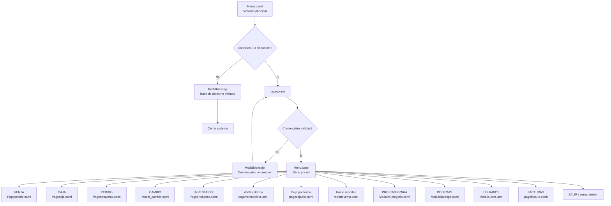
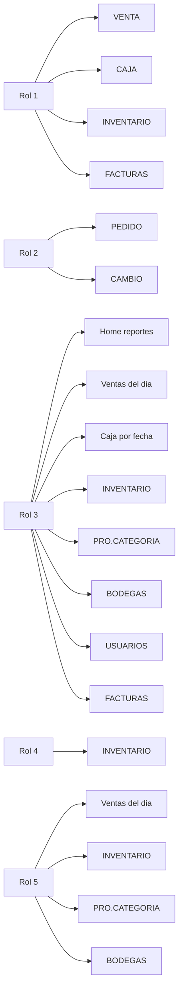
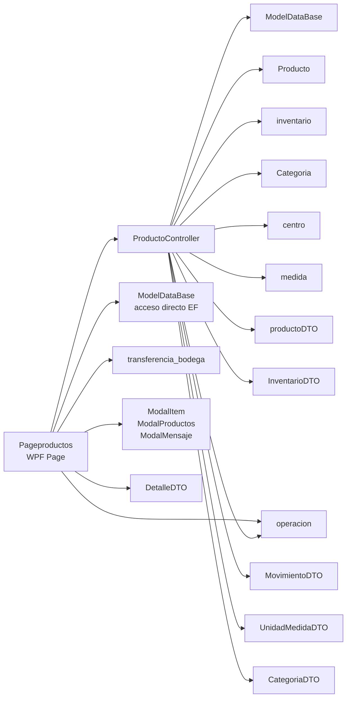
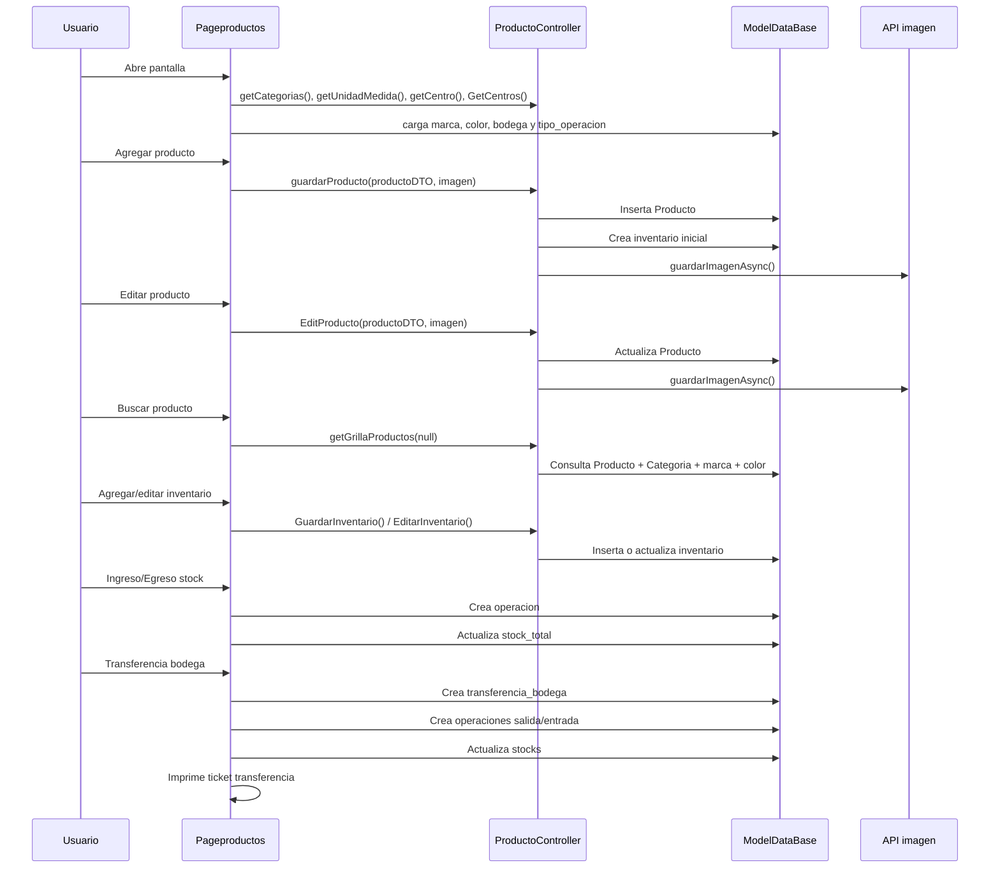
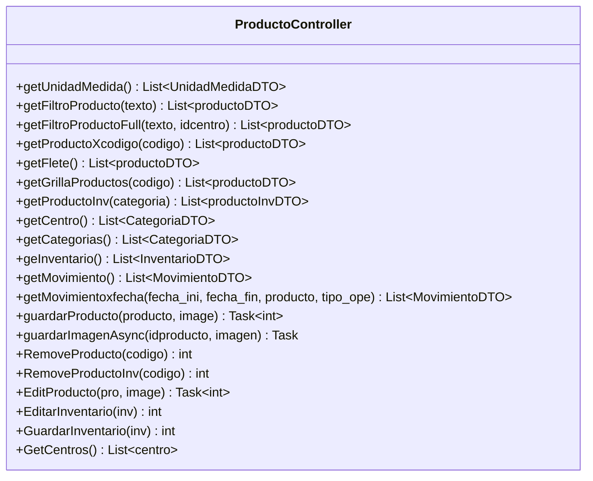
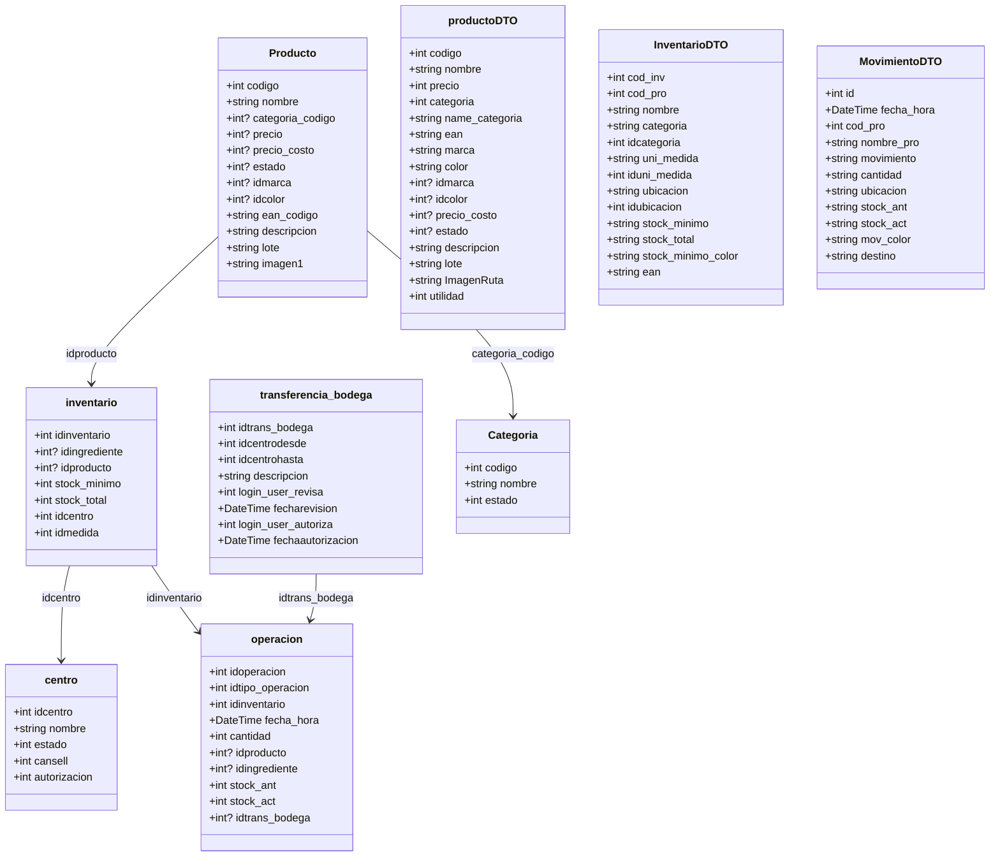

# Diagrama de pantallas

Este diagrama resume la navegacion principal de la aplicacion WPF ubicada en `Erp/ErpSistem`.

## Flujo general

## Menus por rol

## Pantallas y modales principales

```mermaid
flowchart TD
    Pedido["Pagenotaventa.xaml<br/>Pedido / nota de venta"]
    Pedido --> MCantidad["ModalCantidad.xaml"]
    Pedido --> HVenta["HabilitarProceso<br/>Autorizar Venta"]
    Pedido --> HDesc["HabilitarProceso<br/>Habilitar descuento"]
    Pedido --> MDesc["modal_descuento.xaml"]
    Pedido --> MMensaje["ModalMensaje.xaml"]

    Cambio["modal_cambio.xaml<br/>Cambio"]
    Cambio --> MCantDevol["modal_cant_devol.xaml"]
    Cambio --> HCambio["HabilitarProceso<br/>Habilitar Cambio"]
    Cambio --> MCamVen["ModalCambioVenta.xaml"]
    Cambio --> MMensaje

    Venta["Pagepedido.xaml<br/>Venta / atenciones"]
    Venta --> MDevol["ModalDevolucion.xaml"]
    Venta --> MVenta["ModalVenta.xaml"]
    Venta --> HEliminar["HabilitarProceso<br/>Eliminar atencion"]
    Venta --> BAtencion["BuscarAtencion.xaml"]
    Venta --> MMensaje

    MVenta --> MFactura["ModalFactura.xaml"]
    MVenta --> HDesc
    MVenta --> MDesc
    MVenta --> MMensaje

    Caja["Pagecaja.xaml<br/>Caja"]
    Caja --> MApertura["ModalAperturaCaja.xaml<br/>ModalAperturaCierre"]
    Caja --> MMensaje

    Inventario["Pageproductos.xaml<br/>Inventario"]
    Inventario --> MItem["ModalItem.xaml<br/>Marca / color"]
    Inventario --> MProductos["ModalProductos.xaml<br/>Transferencia productos"]
    Inventario --> MMensaje
    MProductos --> MCantidadPro["ModalCantidad.xaml<br/>ModalCantidadPro"]

    Categoria["ModuloCategoria.xaml<br/>Categorias"] --> MMensaje
    Bodega["ModuloBodega.xaml<br/>Bodegas"] --> MMensaje
    Usuarios["ModuloUser.xaml<br/>Usuarios"] --> MMensaje
    ReporteCaja["pagecajadia.xaml<br/>Caja por fecha"] --> MMensaje
    Facturas["pagefactura.xaml<br/>Facturas"] --> MMensaje
```

## Mapa rapido de archivos

| Area | Pantalla | Archivo |
| --- | --- | --- |
| Inicio | Ventana principal | `Erp/ErpSistem/MENU/Home.xaml` |
| Inicio | Login | `Erp/ErpSistem/MENU/Login.xaml` |
| Inicio | Menu | `Erp/ErpSistem/MENU/Menu.xaml` |
| Pedido | Nota de venta | `Erp/ErpSistem/PEDIDO/Pagenotaventa.xaml` |
| Pedido | Cambio | `Erp/ErpSistem/PEDIDO/modal_cambio.xaml` |
| Venta | Atenciones / venta | `Erp/ErpSistem/VENTA/Pagepedido.xaml` |
| Caja | Caja | `Erp/ErpSistem/CAJA/Pagecaja.xaml` |
| Caja | Caja por fecha | `Erp/ErpSistem/CAJA/pagecajadia.xaml` |
| Inventario | Productos | `Erp/ErpSistem/INVENTARIO/Pageproductos.xaml` |
| Inventario | Bodegas | `Erp/ErpSistem/INVENTARIO/ModuloBodega.xaml` |
| Producto | Categorias | `Erp/ErpSistem/PRODUCTO/ModuloCategoria.xaml` |
| Usuarios | Usuarios | `Erp/ErpSistem/USUARIOS/ModuloUser.xaml` |
| Reportes | Ventas del dia | `Erp/ErpSistem/REPORT_VENTA/pageventadeldia.xaml` |
| Reportes | Reporte venta | `Erp/ErpSistem/REPORT_VENTA/reporteventa.xaml` |
| Reportes | Facturas | `Erp/ErpSistem/REPORT_VENTA/pagefactura.xaml` |

## Pageproductos: pantalla, clases y entidades

Archivo principal: `Erp/ErpSistem/INVENTARIO/Pageproductos.xaml`

Code-behind: `Erp/ErpSistem/INVENTARIO/Pageproductos.xaml.cs`

Controlador: `Erp/Controller/ProductoController.cs`

### Diagrama de pantalla

```mermaid
flowchart TD
    Page["Pageproductos.xaml<br/>Modulo inventario/productos"] --> Tabs["TabControl menuCarta"]

    Tabs --> T1["PRODUCTO"]
    Tabs --> T2["INVENTARIO"]
    Tabs --> T3["MOVIMIENTOS"]
    Tabs --> T4["TRANSFERENCIA BODEGA"]

    T1 --> PForm["Formulario producto<br/>Codigo, EAN, nombre, categoria,<br/>marca, color, precio, costo,<br/>descripcion, lote, imagen"]
    T1 --> PActions["Acciones<br/>Agregar, Guardar, Cancelar,<br/>Agregar marca/color, Subir imagen"]
    T1 --> PGrid["dgrid_productos<br/>Codigo, imagen, EAN, nombre,<br/>color, marca, precio, costo,<br/>utilidad, categoria, estado, editar"]

    T2 --> IFormStart["Boton ingresar producto"]
    T2 --> IForm["Formulario inventario<br/>Categoria, producto, ubicacion,<br/>unidad medida, stock minimo, stock total"]
    T2 --> IStock["Formulario stock<br/>Ingreso/Egreso, SKU, producto,<br/>ubicacion, stock actual, cantidad"]
    T2 --> IFilter["Filtro + bodega"]
    T2 --> IGrid["gridinv<br/>Mas/Menos, editar, eliminar,<br/>cod inv, cod pro, nombre,<br/>categoria, medida, ubicacion,<br/>stock minimo, stock total"]

    T3 --> MFilters["Filtros<br/>Fecha inicio, fecha termino,<br/>producto, tipo movimiento"]
    T3 --> MGrid["gridmovimiento<br/>Id, fecha, ubicacion, SKU,<br/>producto, movimiento, cantidad,<br/>stock anterior, stock actual"]

    T4 --> TrHeader["Fecha actual"]
    T4 --> TrForm["Desde, hacia, comentario"]
    T4 --> TrActions["Cancelar, agregar producto,<br/>realizar transferencia"]
    T4 --> TrGrid["tabla_tranfer_pro<br/>Eliminar, codigo, cantidad, producto"]
```

### Flujo general de clases

### Flujo de acciones principales

### Clase Pageproductos

Responsabilidades principales:

- Inicializa combos, grillas y permisos visibles segun rol.
- Administra CRUD de productos desde la pestana `PRODUCTO`.
- Administra inventario, ingreso/egreso de stock y filtros desde la pestana `INVENTARIO`.
- Consulta movimientos desde la pestana `MOVIMIENTOS`.
- Realiza transferencia entre bodegas desde la pestana `TRANSFERENCIA BODEGA`.

Metodos destacados:

| Metodo | Uso |
| --- | --- |
| `Pageproductos()` | Inicializa pantalla, combos, fecha, grillas y visibilidad por rol. |
| `cargarComboCategoria()` | Carga categorias para producto e inventario. |
| `cargarComboProducto(int? codigo)` | Carga productos disponibles para inventario segun categoria. |
| `cargarCentro()` / `cargarBodega()` | Carga ubicaciones/centros. |
| `CargarUnidadMedida()` | Carga unidades de medida. |
| `cargarMarca()` / `cargarColor()` | Carga marcas y colores. |
| `cargarTipoOperacion()` | Carga tipos para filtrar movimientos. |
| `cargarGrid()` | Carga grilla de productos. |
| `FiltrarProducto()` | Filtra productos por marca, nombre, color o EAN. |
| `tb_filtro_inv_KeyUp()` | Filtra inventario por codigo, EAN o nombre. |
| `btn_addCli_Click()` | Valida y agrega un producto. |
| `btn_guardar_pro()` | Guarda cambios de un producto editado. |
| `btn_editar_Click()` | Carga producto seleccionado al formulario. |
| `btn_estado_producto_Click()` | Activa o desactiva un producto. |
| `btn_save_inv_Click()` | Guarda nuevo registro de inventario. |
| `btn_guardar_inv_Click()` | Guarda cambios de inventario. |
| `btn_editar_inv_Click()` | Carga inventario seleccionado al formulario. |
| `btn_eliminar_inv_Click()` | Elimina producto de inventario. |
| `btn_mas_Click()` / `btn_menos_Click()` | Prepara ingreso o egreso de stock. |
| `btn_save_stock_Click()` | Registra operacion y actualiza stock. |
| `actualizarStockInv(int idinventario, int cantidad)` | Actualiza stock total de inventario. |
| `btn_buscar_Click()` | Consulta movimientos por fecha/producto/tipo. |
| `AgregarProductoTransferencia_Click()` | Abre modal para seleccionar productos a transferir. |
| `RealizarTransferencia_Click()` | Valida, crea transferencia, registra salida/entrada y actualiza stocks. |
| `CrearTransferencia()` | Inserta cabecera de transferencia de bodega. |
| `PrintTicketTransferencia()` / `PrintTransferencia()` | Genera e imprime comprobante de transferencia. |
| `UploadImage_Click()` | Carga imagen local al preview. |
| `ConvertImageToBytes()` | Convierte imagen de WPF a bytes para enviar al controlador. |
| `CleanControles()` / `CleanControlesInv()` | Limpia formularios. |

### Clase ProductoController

### Entidades y DTO principales

