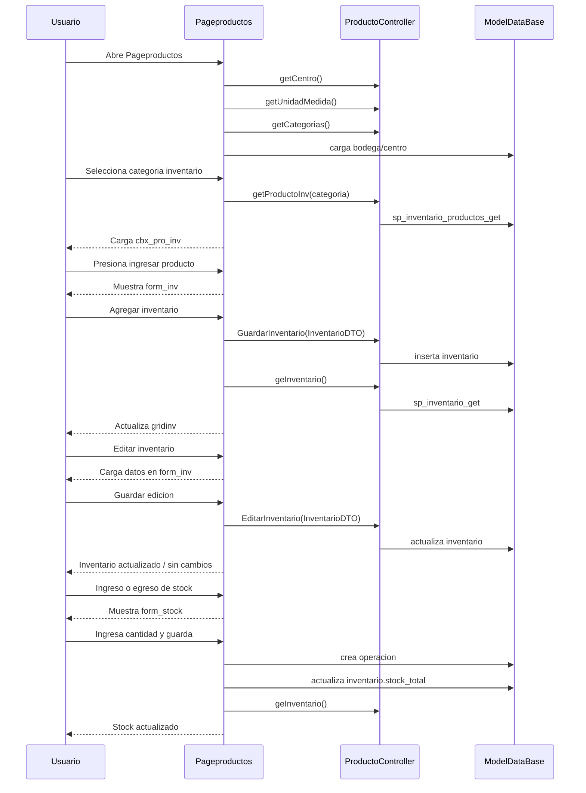
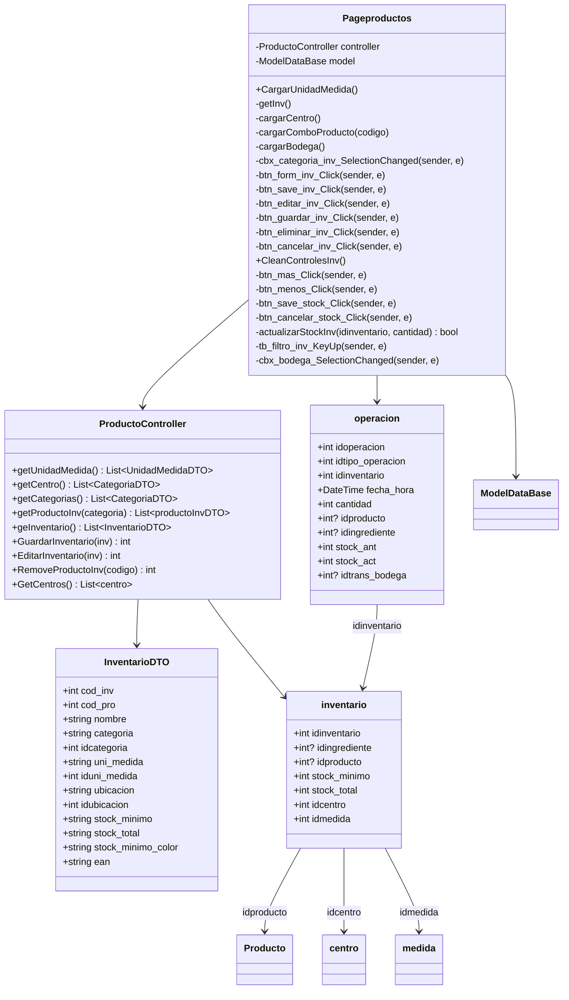
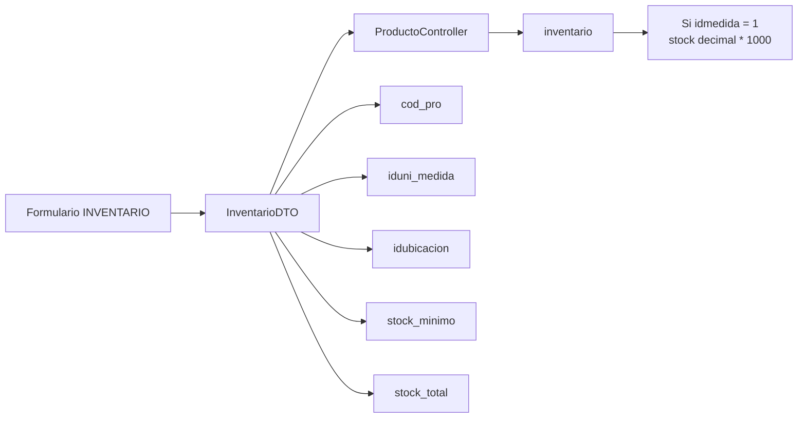
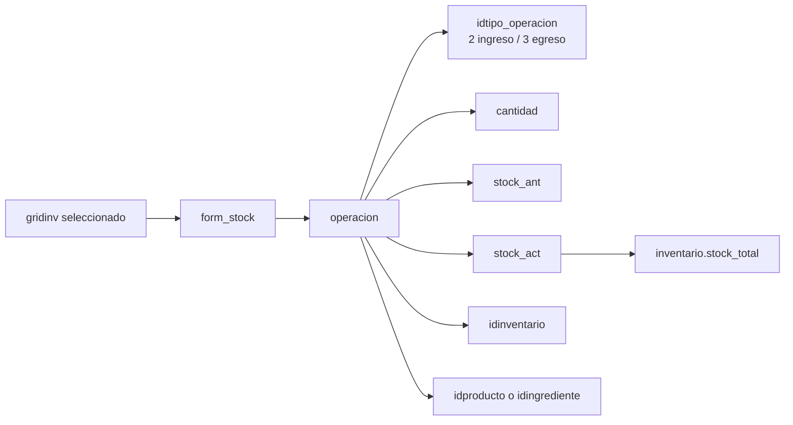

# Diagrama tab INVENTARIO - Pageproductos

Este documento describe solo la pestana `INVENTARIO` de `Pageproductos.xaml`.

Archivo pantalla: `Erp/ErpSistem/INVENTARIO/Pageproductos.xaml`

Code-behind: `Erp/ErpSistem/INVENTARIO/Pageproductos.xaml.cs`

Controlador: `Erp/Controller/ProductoController.cs`

## Pantalla

```mermaid
flowchart TD
    Tab["Tab INVENTARIO<br/>Pageproductos.xaml"] --> FormIngreso["form_ing_egre<br/>Acceso ingresar producto"]
    Tab --> FormInv["form_inv<br/>Formulario inventario"]
    Tab --> FormStock["form_stock<br/>Ingreso/Egreso stock"]
    Tab --> Filtro["Filtro inventario"]
    Tab --> Grid["gridinv"]

    FormIngreso --> BtnForm["btn_form_inv<br/>Ingresar producto"]

    FormInv --> CodInv["tb_cod_inv<br/>Cod.Inv"]
    FormInv --> Cat["cbx_categoria_inv<br/>Categoria"]
    FormInv --> Producto["cbx_pro_inv<br/>Producto"]
    FormInv --> Ubicacion["cbx_ubicacion<br/>Ubicacion/Centro"]
    FormInv --> Medida["cbx_unimedida_inv<br/>Unidad medida"]
    FormInv --> StockMin["tb_stock_min<br/>Stock minimo"]
    FormInv --> StockTotal["tb_stock_total<br/>Stock total"]
    FormInv --> SaveInv["btn_save_inv<br/>Agregar"]
    FormInv --> GuardarInv["btn_guardar_inv<br/>Guardar edicion"]
    FormInv --> CancelInv["btn_cancelar_inv<br/>Cancelar"]

    FormStock --> Operacion["lab_operacion<br/>Ingreso o egreso"]
    FormStock --> Sku["tb_sku<br/>SKU"]
    FormStock --> Nombre["tb_producto<br/>Producto"]
    FormStock --> MedidaStock["tb_medida<br/>Unidad medida"]
    FormStock --> UbiStock["tb_ubicacion<br/>Ubicacion"]
    FormStock --> StockActual["tb_stock_actual<br/>Stock actual"]
    FormStock --> Cantidad["tb_cant_stock<br/>Cantidad"]
    FormStock --> SaveStock["btn_save_stock<br/>Guardar movimiento"]
    FormStock --> CancelStock["btn_cancelar_stock<br/>Cancelar"]

    Filtro --> TxtFiltro["tb_filtro_inv<br/>Filtro por SKU/EAN/nombre"]
    Filtro --> Bodega["cbx_bodega<br/>Filtro bodega"]

    Grid --> Menos["btn_menos<br/>Egreso stock"]
    Grid --> Mas["btn_mas<br/>Ingreso stock"]
    Grid --> Editar["btn_editar<br/>Editar inventario"]
    Grid --> Eliminar["btn_eliminar<br/>Eliminar inventario"]
    Grid --> Cols["Columnas"]
    Cols --> C1["Cod.Inv"]
    Cols --> C2["Cod.Pro"]
    Cols --> C3["Nombre"]
    Cols --> C4["Categoria"]
    Cols --> C5["U.medida"]
    Cols --> C6["Ubicacion"]
    Cols --> C7["Stock minimo"]
    Cols --> C8["Stock total"]
```

## Flujo de uso

## Clases relacionadas

## Metodos de la pestana INVENTARIO

| Metodo | Funcion |
| --- | --- |
| `CargarUnidadMedida()` | Carga unidades de medida en `cbx_unimedida_inv`. |
| `cargarCentro()` | Carga centros activos en `cbx_ubicacion`. |
| `cargarBodega()` | Carga centros/bodegas para filtro `cbx_bodega`. |
| `cargarComboProducto(codigo)` | Carga productos por categoria para `cbx_pro_inv`. |
| `getInv()` | Carga `gridinv` con `controller.geInventario()`. |
| `cbx_categoria_inv_SelectionChanged()` | Al cambiar categoria, actualiza productos disponibles. |
| `btn_form_inv_Click()` | Muestra formulario para agregar inventario. |
| `btn_save_inv_Click()` | Crea un registro de inventario. |
| `btn_editar_inv_Click()` | Carga el inventario seleccionado para edicion. |
| `btn_guardar_inv_Click()` | Guarda cambios del inventario editado. |
| `btn_eliminar_inv_Click()` | Elimina el registro de inventario seleccionado. |
| `btn_cancelar_inv_Click()` | Cancela formulario de inventario y limpia controles. |
| `CleanControlesInv()` | Limpia combos, stock, validaciones y estado del formulario. |
| `btn_mas_Click()` | Abre formulario de ingreso de stock. |
| `btn_menos_Click()` | Abre formulario de egreso de stock. |
| `btn_save_stock_Click()` | Registra operacion de stock y actualiza `stock_total`. |
| `btn_cancelar_stock_Click()` | Cancela ingreso/egreso de stock. |
| `actualizarStockInv()` | Actualiza `inventario.stock_total`. |
| `tb_filtro_inv_KeyUp()` | Filtra inventario al presionar Enter. |
| `cbx_bodega_SelectionChanged()` | Aplica filtro por bodega/centro. |

## Datos que se guardan al crear/editar inventario

## Datos que se guardan al mover stock

## Observaciones

- Cuando `iduni_medida == 1`, el codigo convierte cantidades decimales a enteros multiplicando por `1000`.
- En `btn_save_stock_Click()`, si `idcategoria == 6`, la operacion usa `idingrediente`; en caso contrario usa `idproducto`.
- `RemoveProductoInv()` retorna `1` cuando `SaveChanges()` es mayor que cero, pero la UI interpreta `2` como eliminado. Conviene revisar ese contrato antes de migrarlo a API.
