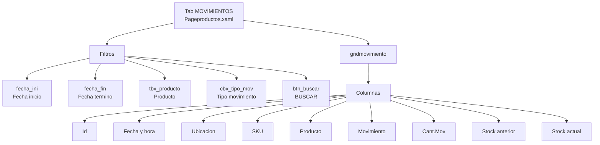
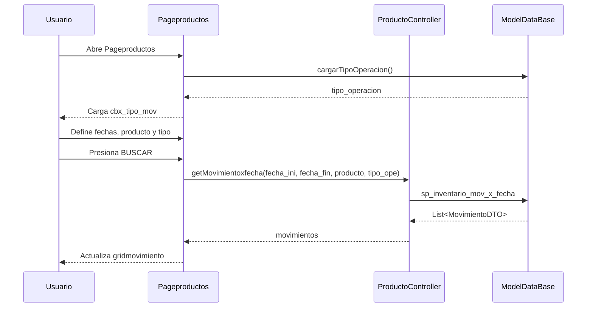
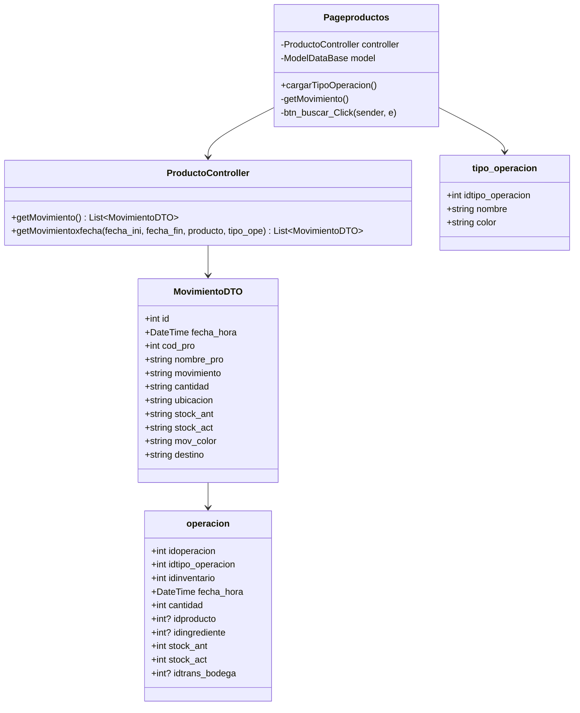
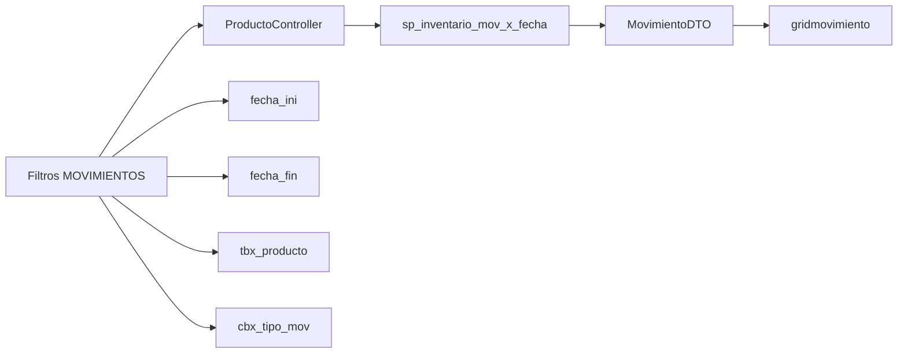

# Diagrama tab MOVIMIENTOS - Pageproductos

Este documento describe solo la pestana `MOVIMIENTOS` de `Pageproductos.xaml`.

Archivo pantalla: `Erp/ErpSistem/INVENTARIO/Pageproductos.xaml`

Code-behind: `Erp/ErpSistem/INVENTARIO/Pageproductos.xaml.cs`

Controlador: `Erp/Controller/ProductoController.cs`

## Pantalla

## Flujo de uso

## Clases relacionadas

## Metodos de la pestana MOVIMIENTOS

| Metodo | Funcion |
| --- | --- |
| `cargarTipoOperacion()` | Carga los tipos de operacion en `cbx_tipo_mov`. |
| `getMovimiento()` | Carga todos los movimientos con `controller.getMovimiento()`. |
| `btn_buscar_Click()` | Consulta movimientos por fecha, producto y tipo de movimiento. |

## Datos consultados

## Observaciones

- La grilla es solo de consulta; esta pestana no crea ni modifica movimientos.
- Los movimientos se originan principalmente desde `INVENTARIO` y `TRANSFERENCIA BODEGA`.
- El color de la columna `Movimiento` viene desde `mov_color`.
