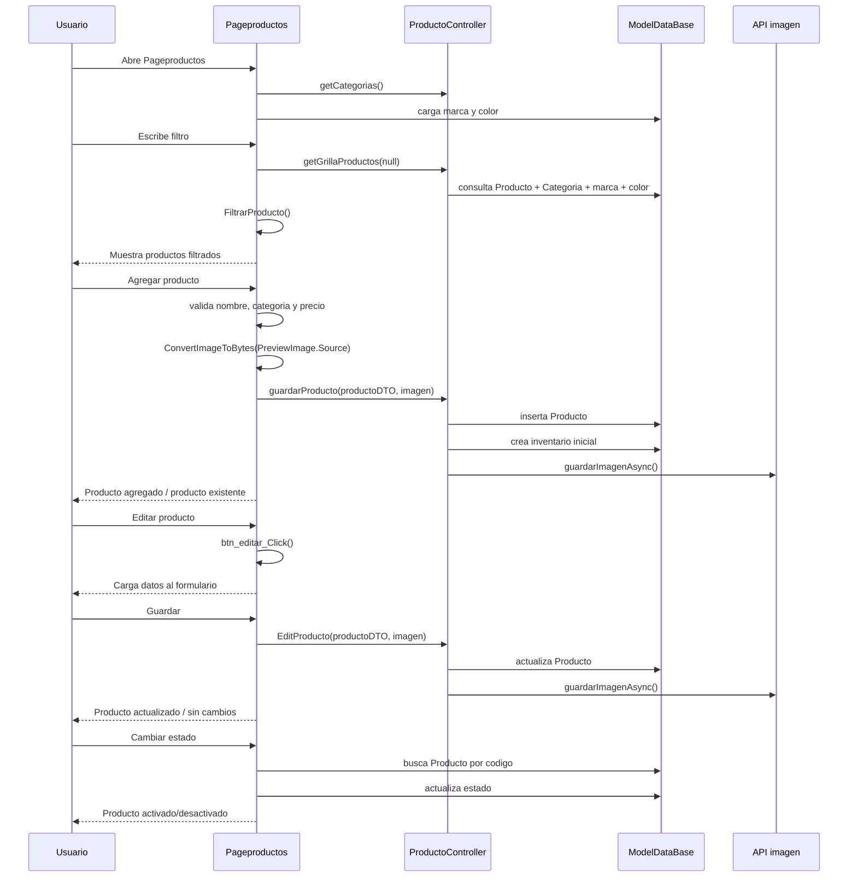
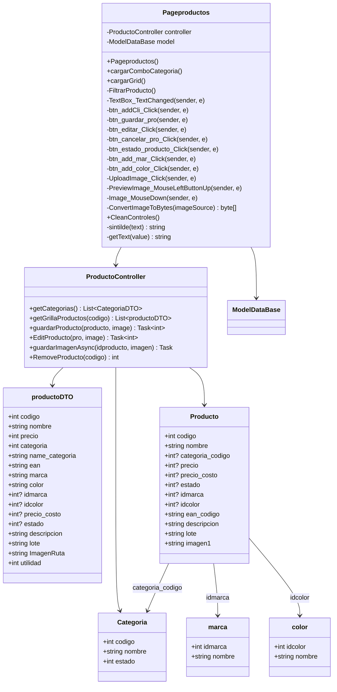
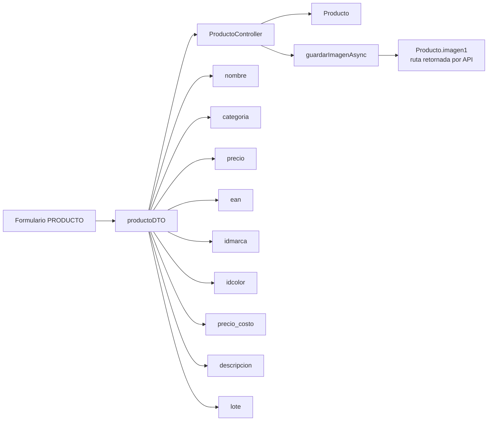

# Diagrama tab PRODUCTO - Pageproductos

Este documento describe solo la pestana `PRODUCTO` de `Pageproductos.xaml`.

Archivo pantalla: `Erp/ErpSistem/INVENTARIO/Pageproductos.xaml`

Code-behind: `Erp/ErpSistem/INVENTARIO/Pageproductos.xaml.cs`

Controlador: `Erp/Controller/ProductoController.cs`

## Pantalla

```mermaid
flowchart TD
    Tab["Tab PRODUCTO<br/>Pageproductos.xaml"] --> Form["Formulario producto"]
    Tab --> Grid["dgrid_productos"]
    Tab --> ImageBox["Imagen producto"]

    Form --> Codigo["codigo<br/>TextBox deshabilitado"]
    Form --> Ean["tb_ean<br/>EAN"]
    Form --> Nombre["tb_nombre<br/>Nombre"]
    Form --> Categoria["cbx_categoria<br/>Categoria"]
    Form --> Marca["cbx_marca<br/>Marca"]
    Form --> Color["cbx_color<br/>Color"]
    Form --> Descripcion["tb_descripcion<br/>Descripcion"]
    Form --> Lote["tb_lote<br/>Lote"]
    Form --> Precio["tb_precio<br/>Precio venta"]
    Form --> Costo["tb_precio_costo<br/>Precio costo"]
    Form --> Filtro["tb_filtro_producto<br/>Filtro"]

    Form --> Acciones["Acciones"]
    Acciones --> Add["btn_addCli<br/>Agregar"]
    Acciones --> Save["btn_guardar<br/>Guardar edicion"]
    Acciones --> Cancel["btn_cancelar<br/>Cancelar edicion"]
    Acciones --> AddMarca["btn_add_mar<br/>Agregar marca"]
    Acciones --> AddColor["btn_add_color<br/>Agregar color"]

    ImageBox --> Upload["UploadImage_Click<br/>Subir imagen"]
    ImageBox --> Preview["PreviewImage<br/>Vista previa"]
    ImageBox --> OpenPreview["PreviewImage_MouseLeftButtonUp<br/>Abrir imagen grande"]

    Grid --> Cols["Columnas"]
    Cols --> G1["Codigo"]
    Cols --> G2["Imagen"]
    Cols --> G3["EAN"]
    Cols --> G4["Nombre"]
    Cols --> G5["Color"]
    Cols --> G6["Marca"]
    Cols --> G7["Precio"]
    Cols --> G8["Precio costo"]
    Cols --> G9["Utilidad"]
    Cols --> G10["Categoria"]
    Cols --> G11["Estado"]
    Cols --> G12["Editar"]
```

## Flujo de uso

## Clases relacionadas

## Metodos de la pestana PRODUCTO

| Metodo | Funcion |
| --- | --- |
| `cargarComboCategoria()` | Carga categorias activas en `cbx_categoria`. |
| `cargarGrid()` | Carga `dgrid_productos` por categoria o todos los productos. |
| `FiltrarProducto()` | Filtra productos por marca, nombre, color o EAN. |
| `TextBox_TextChanged()` | Ejecuta filtro al presionar Enter en `tb_filtro_producto`. |
| `btn_addCli_Click()` | Valida formulario y crea un producto nuevo. |
| `btn_guardar_pro()` | Guarda cambios del producto editado. |
| `btn_editar_Click()` | Carga el producto seleccionado al formulario. |
| `btn_cancelar_pro_Click()` | Cancela la edicion y limpia controles. |
| `btn_estado_producto_Click()` | Activa o desactiva el producto seleccionado. |
| `btn_add_mar_Click()` | Abre `ModalItem` para crear una marca. |
| `btn_add_color_Click()` | Abre `ModalItem` para crear un color. |
| `UploadImage_Click()` | Selecciona imagen local y la muestra en `PreviewImage`. |
| `PreviewImage_MouseLeftButtonUp()` | Abre la imagen de preview en una ventana. |
| `Image_MouseDown()` | Abre la imagen de la grilla en una ventana. |
| `ConvertImageToBytes()` | Convierte la imagen a `byte[]` para enviarla al controlador. |
| `CleanControles()` | Limpia campos, combos, validaciones e imagen. |

## Datos que se guardan al crear/editar

