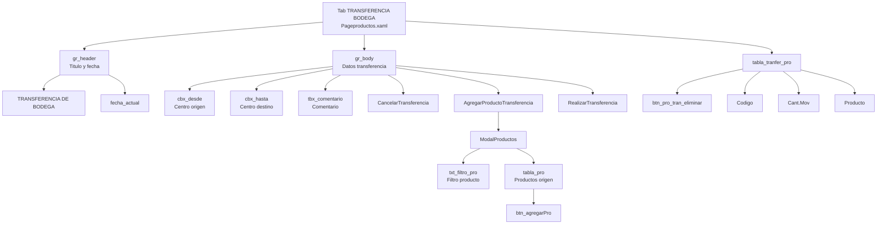
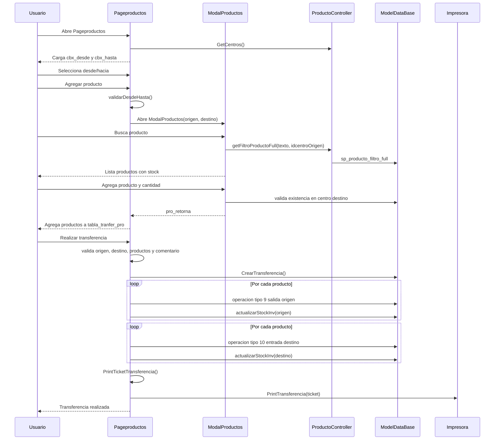
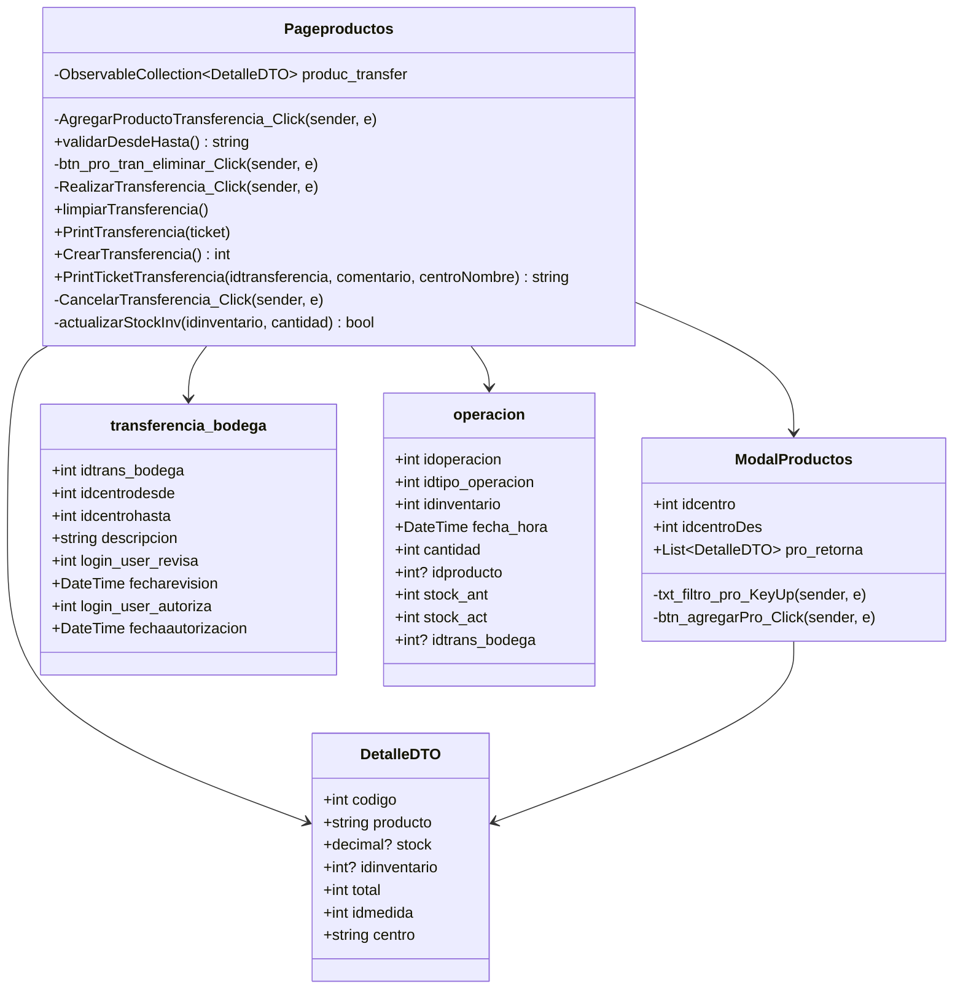
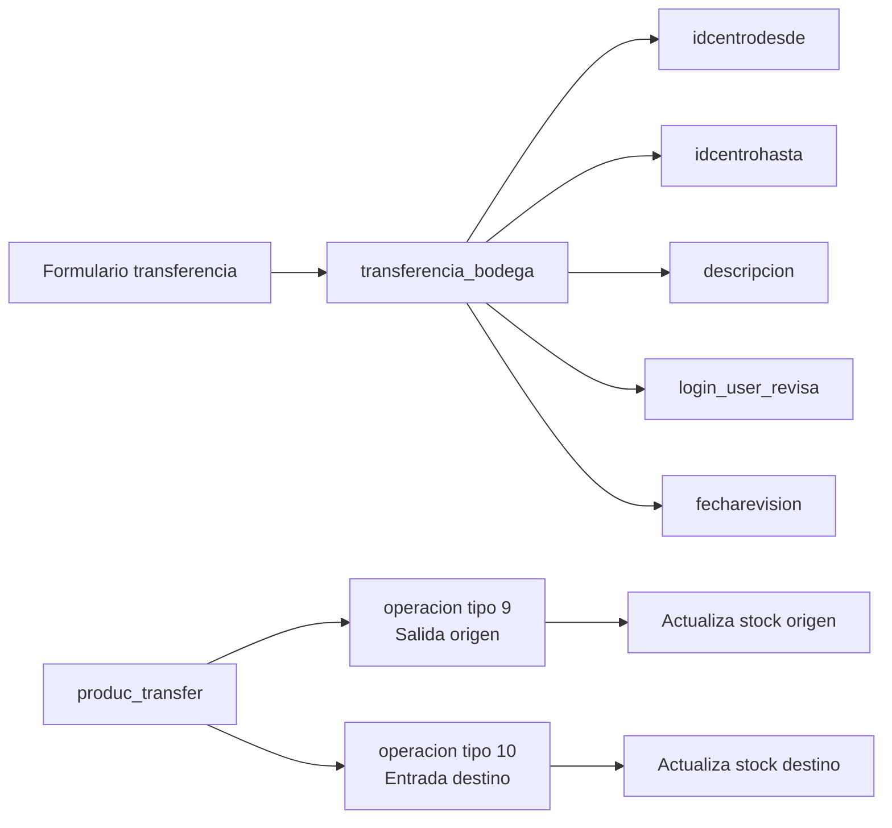

# Diagrama tab TRANSFERENCIA BODEGA - Pageproductos

Este documento describe solo la pestana `TRANSFERENCIA BODEGA` de `Pageproductos.xaml`.

Archivo pantalla: `Erp/ErpSistem/INVENTARIO/Pageproductos.xaml`

Code-behind: `Erp/ErpSistem/INVENTARIO/Pageproductos.xaml.cs`

Modal relacionado: `Erp/ErpSistem/INVENTARIO/ModalProductos.xaml`

## Pantalla

## Flujo de uso

## Clases relacionadas

## Metodos de la pestana TRANSFERENCIA BODEGA

| Metodo | Funcion |
| --- | --- |
| `AgregarProductoTransferencia_Click()` | Valida origen/destino y abre `ModalProductos`. |
| `validarDesdeHasta()` | Valida centro origen, centro destino y que sean distintos. |
| `btn_pro_tran_eliminar_Click()` | Elimina un producto de `produc_transfer`. |
| `RealizarTransferencia_Click()` | Crea transferencia, registra operaciones, actualiza stock e imprime ticket. |
| `limpiarTransferencia()` | Limpia productos, comentario y habilita combos. |
| `PrintTransferencia()` | Imprime el ticket generado. |
| `CrearTransferencia()` | Inserta `transferencia_bodega` y retorna su id. |
| `PrintTicketTransferencia()` | Construye el texto del ticket. |
| `CancelarTransferencia_Click()` | Cancela y limpia la transferencia. |
| `ModalProductos.txt_filtro_pro_KeyUp()` | Busca productos del centro origen. |
| `ModalProductos.btn_agregarPro_Click()` | Valida cantidad, destino y agrega producto a la transferencia. |

## Datos que se guardan

## Observaciones

- Al agregar el primer producto, `cbx_desde` y `cbx_hasta` se deshabilitan para mantener consistente la transferencia.
- `ModalProductos` valida que el producto tenga stock suficiente en origen y que exista inventario en el centro destino.
- La transferencia genera dos movimientos por producto: tipo `9` para salida y tipo `10` para entrada.
- La operacion completa no esta envuelta en una transaccion; conviene corregirlo al migrar a microservicio.
