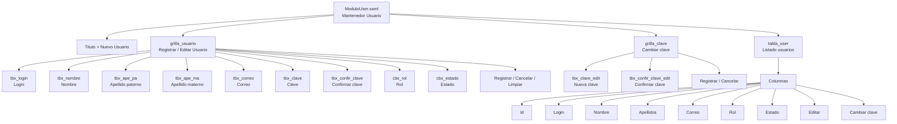
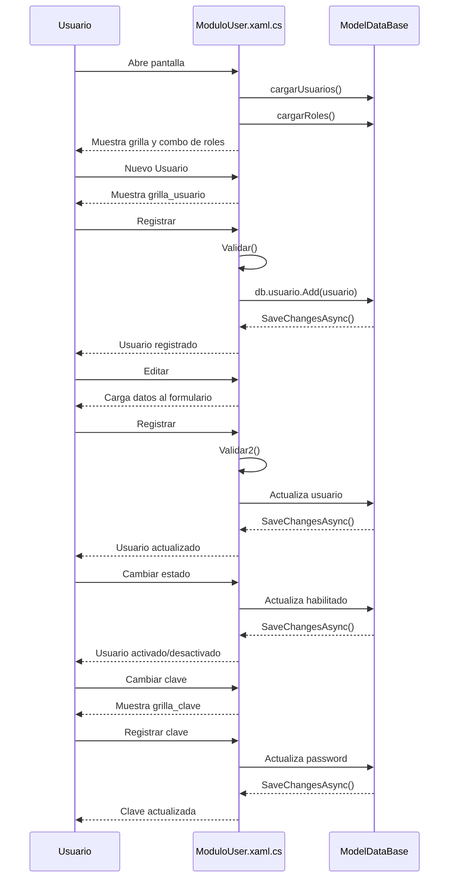
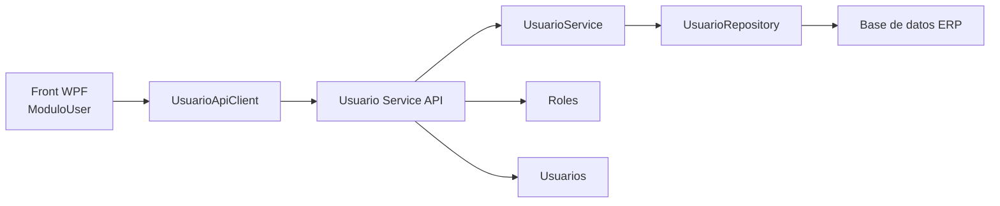

# Microservicio pantalla USUARIO - ModuloUser

Este documento describe la pantalla `ModuloUser.xaml` y propone separar su logica en API y front.

- UI actual: `Erp/ErpSistem/USUARIOS/ModuloUser.xaml`
- Code-behind actual: `Erp/ErpSistem/USUARIOS/ModuloUser.xaml.cs`
- DTO actual: `Erp/DTO/UsuarioDTO.cs`
- Entidades actuales: `Erp/Model/usuario.cs`, `Erp/Model/rol.cs`

## Objetivo

Separar el mantenedor de usuarios en dos partes:

- API: reglas de negocio, consultas, validaciones contra base de datos y persistencia.
- Front WPF: formulario, grilla, mensajes, estados visuales y consumo HTTP de la API.

La pantalla actual accede directamente a `ModelDataBase` desde el code-behind. La propuesta es que `ModuloUser.xaml.cs` deje de consultar Entity Framework y use un cliente HTTP o servicio de aplicacion para consumir endpoints.

## Pantalla actual



## Flujo actual



## Arquitectura propuesta



## Responsabilidades

| Capa | Responsabilidad |
| --- | --- |
| `ModuloUser.xaml` | Controles visuales: formulario, grilla, botones, checkboxes y combo de roles. |
| `ModuloUser.xaml.cs` | Eventos de UI, estados visibles, lectura/escritura de campos y mensajes. |
| `UsuarioApiClient` | Llamadas HTTP a la API y conversion de contratos JSON. |
| `Usuario Service API` | Endpoints REST para usuarios y roles. |
| `UsuarioService` | Validaciones, reglas de negocio y coordinacion de persistencia. |
| `UsuarioRepository` | Consultas y actualizaciones en `usuario` y `rol`. |

## Endpoints propuestos

Base path sugerido: `/api/usuarios`

| Metodo | Ruta | Uso en pantalla | Equivalente actual |
| --- | --- | --- | --- |
| `GET` | `/api/usuarios` | Cargar `tabla_user` | `cargarUsuarios()` |
| `GET` | `/api/usuarios/{id}` | Obtener usuario para editar | Datos de `tabla_user.SelectedItem` |
| `POST` | `/api/usuarios` | Registrar nuevo usuario | `db.usuario.Add(usuario)` |
| `PUT` | `/api/usuarios/{id}` | Editar datos de usuario | Actualizacion en `btn_registrar_Click` |
| `PATCH` | `/api/usuarios/{id}/estado` | Activar/desactivar usuario | `CheckBox_Checked` |
| `PATCH` | `/api/usuarios/{id}/clave` | Cambiar clave | `btn_registrar_clave_Click` |
| `GET` | `/api/usuarios/roles` | Cargar combo `cbx_rol` | `cargarRoles()` |

## Contratos

### UsuarioResponse

```json
{
  "idusuario": 1,
  "login": "admin",
  "nombre": "Jose",
  "ape_pa": "Diaz",
  "ape_ma": "Ramirez",
  "apellidos": "Diaz Ramirez",
  "correo": "admin@example.com",
  "habilitado": 1,
  "idrol": 2,
  "roles": "Administrador"
}
```

### CrearUsuarioRequest

```json
{
  "login": "admin",
  "nombre": "Jose",
  "ape_pa": "Diaz",
  "ape_ma": "Ramirez",
  "correo": "admin@example.com",
  "password": "claveTemporal",
  "confirmarPassword": "claveTemporal",
  "idrol": 2,
  "habilitado": 1
}
```

### ActualizarUsuarioRequest

```json
{
  "login": "admin",
  "nombre": "Jose",
  "ape_pa": "Diaz",
  "ape_ma": "Ramirez",
  "correo": "admin@example.com",
  "idrol": 2,
  "habilitado": 1
}
```

### CambiarEstadoUsuarioRequest

```json
{
  "habilitado": 1
}
```

### CambiarClaveUsuarioRequest

```json
{
  "password": "nuevaClave",
  "confirmarPassword": "nuevaClave"
}
```

### RolResponse

```json
{
  "idrol": 2,
  "nombre": "Administrador",
  "descripcion": "Acceso administrativo"
}
```

## Reglas de negocio

| Regla | Detalle |
| --- | --- |
| Login obligatorio | La UI actual exige `tbx_login`. |
| Nombre obligatorio | La UI actual exige `tbx_nombre`. |
| Apellido paterno obligatorio | La UI actual exige `tbx_ape_pa`. |
| Rol obligatorio | Debe seleccionarse un rol distinto de `0`. |
| Clave obligatoria al crear | La creacion exige `tbx_clave`. |
| Confirmacion de clave | `password` y `confirmarPassword` deben coincidir. |
| Clave no viaja al listar | El listado nunca debe devolver `password`. |
| Estado binario | `habilitado` usa `1` activo y `0` inactivo. |
| Edicion sin clave | Editar datos de usuario no cambia la clave. |
| Cambio de clave separado | La clave se modifica solo desde `/clave`. |

## Validaciones sugeridas en API

- Rechazar login vacio o solo espacios.
- Rechazar nombre vacio o solo espacios.
- Rechazar apellido paterno vacio o solo espacios.
- Rechazar rol inexistente.
- Rechazar claves vacias al crear o cambiar clave.
- Rechazar confirmacion de clave diferente.
- Validar formato de correo si viene informado.
- Validar login unico si la base de datos lo requiere.
- Guardar clave con hash, no como texto plano.

## Cambios sugeridos en front WPF

Crear un cliente para encapsular las llamadas:

```csharp
public class UsuarioApiClient
{
    public Task<List<UsuarioDTO>> GetUsuariosAsync();
    public Task<List<RolDTO>> GetRolesAsync();
    public Task<UsuarioDTO> CrearUsuarioAsync(CrearUsuarioRequest request);
    public Task<UsuarioDTO> ActualizarUsuarioAsync(int idusuario, ActualizarUsuarioRequest request);
    public Task CambiarEstadoAsync(int idusuario, int habilitado);
    public Task CambiarClaveAsync(int idusuario, CambiarClaveUsuarioRequest request);
}
```

El code-behind quedaria encargado de:

- Mostrar u ocultar `grilla_usuario` y `grilla_clave`.
- Cargar datos desde `UsuarioApiClient`.
- Construir requests desde los controles.
- Mostrar `ModalMensaje`.
- Refrescar `tabla_user` despues de crear, editar, cambiar estado o cambiar clave.

## Mapeo de eventos actuales

| Evento actual | Nueva responsabilidad front | Llamada API |
| --- | --- | --- |
| `ModuloUser()` | Inicializar UI y cargar datos | `GET /api/usuarios`, `GET /api/usuarios/roles` |
| `nuevo_usuario_Click` | Mostrar formulario de creacion | No aplica |
| `btn_registrar_Click` creando | Validar UI basica y enviar request | `POST /api/usuarios` |
| `btn_registrar_Click` editando | Validar UI basica y enviar request | `PUT /api/usuarios/{id}` |
| `btn_editar_Click` | Copiar datos seleccionados al formulario | Opcional `GET /api/usuarios/{id}` |
| `CheckBox_Checked` | Enviar nuevo estado | `PATCH /api/usuarios/{id}/estado` |
| `btn_cambiar_clave_Click` | Mostrar formulario de clave | No aplica |
| `btn_registrar_clave_Click` | Enviar nueva clave | `PATCH /api/usuarios/{id}/clave` |
| `btn_cancelar_Click` | Ocultar formulario y limpiar | No aplica |
| `btn_limpiar_Click` | Limpiar campos | No aplica |

## Estructura sugerida API

```text
Api/
  Controllers/
    UsuariosController.cs
  Services/
    UsuarioService.cs
  Repositories/
    UsuarioRepository.cs
  Contracts/
    UsuarioResponse.cs
    CrearUsuarioRequest.cs
    ActualizarUsuarioRequest.cs
    CambiarEstadoUsuarioRequest.cs
    CambiarClaveUsuarioRequest.cs
    RolResponse.cs
```

## Estructura sugerida front

```text
Erp/ErpSistem/
  ApiClients/
    UsuarioApiClient.cs
  USUARIOS/
    ModuloUser.xaml
    ModuloUser.xaml.cs
```

## Pendientes tecnicos detectados

- En `Validar()` existe una comparacion incorrecta: `tbx_confir_clave.Password.Equals(tbx_confir_clave.Password)` siempre compara el campo consigo mismo. Debe comparar clave contra confirmacion.
- La clave se guarda actualmente en `usuario.password` como texto plano. La API debe aplicar hash.
- `CheckBox_Checked` depende de `tabla_user.SelectedItem`; conviene tomar el usuario desde el `DataContext` del checkbox para evitar actualizar una fila equivocada.
- El code-behind mantiene una instancia larga de `ModelDataBase`; al separar API/front, la conexion queda fuera del WPF.
- `UsuarioDTO.estado` devuelve texto vacio para usuarios inactivos; podria devolver `INACTIVO` si se necesita mostrar estado textual.
