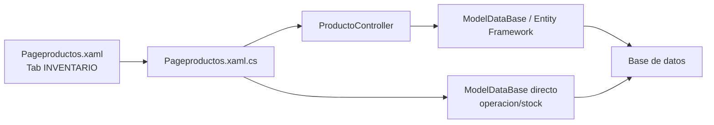
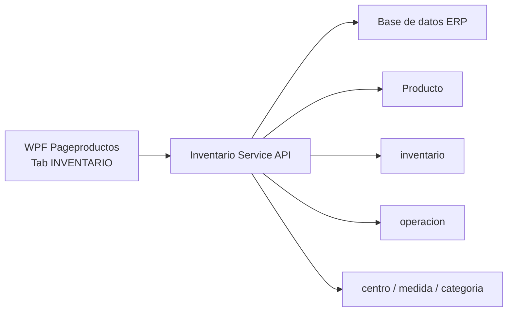
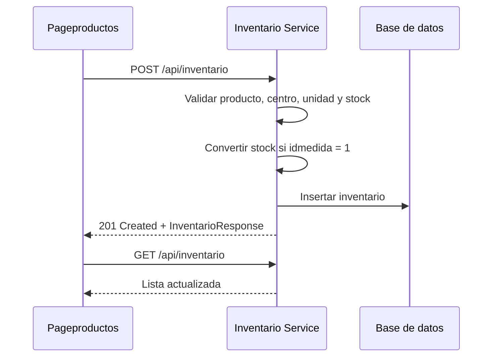
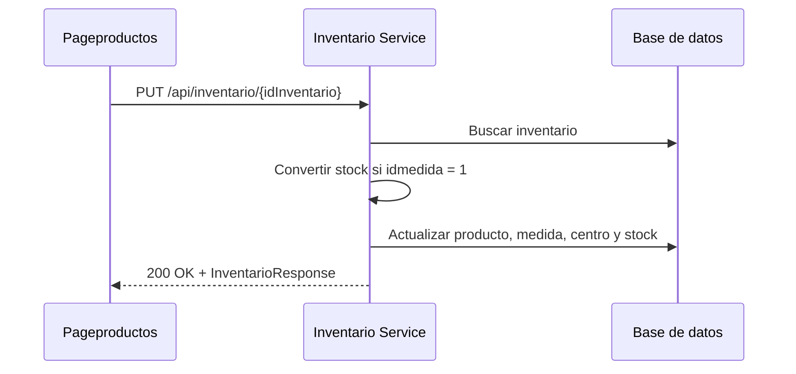
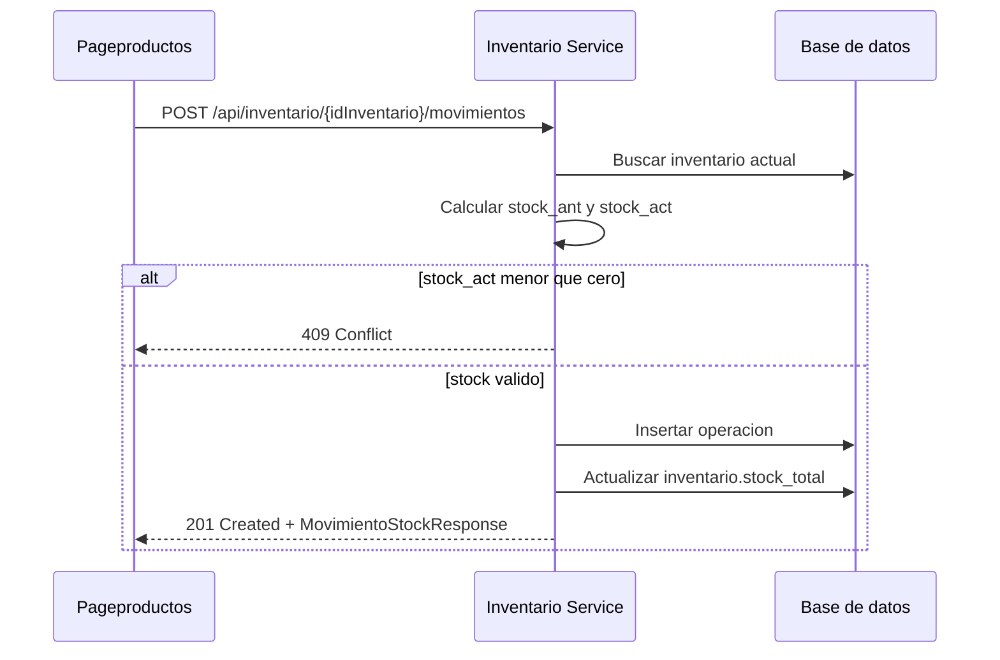

# Microservicio tab INVENTARIO

Este documento separa la logica de la pestana `INVENTARIO` de `Pageproductos.xaml` en una propuesta de microservicio.

- UI: `Erp/ErpSistem/INVENTARIO/Pageproductos.xaml`
- Code-behind: `Erp/ErpSistem/INVENTARIO/Pageproductos.xaml.cs`
- Controlador actual: `Erp/Controller/ProductoController.cs`
- DTO principal: `Erp/DTO/InventarioDTO.cs`
- Entidad principal: `Erp/Model/inventario.cs`
- Entidad de movimientos: `Erp/Model/operacion.cs`

## Objetivo

Centralizar la administracion de inventario para que la pestana `INVENTARIO` consuma una API en vez de leer/escribir directamente desde WPF con `ProductoController` y `ModelDataBase`.

El microservicio debe cubrir:

- Listado de inventario.
- Busqueda por producto, EAN, nombre y bodega.
- Creacion de registros de inventario.
- Edicion de centro, unidad de medida, stock minimo y stock total.
- Eliminacion de registros de inventario.
- Ingreso y egreso de stock.
- Registro historico en `operacion`.
- Consulta de categorias, productos por categoria, centros/bodegas y unidades de medida.

## Contexto actual



## Arquitectura propuesta



## Responsabilidades del microservicio

| Responsabilidad | Descripcion |
| --- | --- |
| Inventario por producto | Mantiene la relacion producto-centro-medida-stock. |
| Catalogos | Entrega categorias, productos disponibles, centros y unidades de medida. |
| Stock | Aplica ingresos y egresos validando que el stock no quede negativo. |
| Movimientos | Registra cada cambio de stock en `operacion`. |
| Conversion de unidades | Conserva la regla actual de multiplicar por `1000` cuando `idmedida = 1`. |
| Busqueda | Permite filtrar por SKU, EAN, nombre y bodega/centro. |

## Endpoints propuestos

Base path sugerido: `/api/inventario`

| Metodo | Ruta | Uso en pantalla | Equivalente actual |
| --- | --- | --- | --- |
| `GET` | `/api/inventario` | Cargar `gridinv` | `geInventario()` |
| `GET` | `/api/inventario?texto={texto}` | Filtro por SKU/EAN/nombre | `tb_filtro_inv_KeyUp()` + `geInventario()` |
| `GET` | `/api/inventario?bodega={id}` | Filtro por bodega | `cbx_bodega_SelectionChanged()` |
| `POST` | `/api/inventario` | Agregar inventario | `GuardarInventario(inv)` |
| `PUT` | `/api/inventario/{idInventario}` | Editar inventario | `EditarInventario(inv)` |
| `DELETE` | `/api/inventario/{idInventario}` | Eliminar inventario | `RemoveProductoInv(codigo)` |
| `POST` | `/api/inventario/{idInventario}/movimientos` | Ingreso/egreso de stock | `btn_save_stock_Click()` |
| `GET` | `/api/inventario/categorias` | Combo categoria | `getCategorias()` |
| `GET` | `/api/inventario/categorias/{id}/productos` | Combo producto | `getProductoInv(categoria)` |
| `GET` | `/api/inventario/centros` | Combo ubicacion/bodega | `getCentro()` / `GetCentros()` |
| `GET` | `/api/inventario/unidades-medida` | Combo unidad medida | `getUnidadMedida()` |

## Contratos

### InventarioResponse

```json
{
  "codInv": 10,
  "codPro": 123,
  "nombre": "MARTILLO",
  "categoria": "HERRAMIENTAS",
  "idcategoria": 4,
  "uniMedida": "UN",
  "iduniMedida": 3,
  "ubicacion": "BODEGA CENTRAL",
  "idubicacion": 1,
  "stockMinimo": "5",
  "stockTotal": "20",
  "stockMinimoColor": "#FFFFFF",
  "ean": "7800000000000"
}
```

### CrearInventarioRequest

```json
{
  "codPro": 123,
  "idubicacion": 1,
  "iduniMedida": 3,
  "stockMinimo": "5",
  "stockTotal": "20"
}
```

### ActualizarInventarioRequest

```json
{
  "codPro": 123,
  "idubicacion": 2,
  "iduniMedida": 3,
  "stockMinimo": "8",
  "stockTotal": "20"
}
```

### CrearMovimientoStockRequest

```json
{
  "tipo": "INGRESO",
  "cantidad": "3"
}
```

Valores sugeridos para `tipo`:

| Tipo API | `idtipo_operacion` actual | Efecto |
| --- | --- | --- |
| `INGRESO` | `2` | Suma cantidad al stock actual. |
| `EGRESO` | `3` | Resta cantidad al stock actual. |

### MovimientoStockResponse

```json
{
  "idOperacion": 501,
  "idInventario": 10,
  "idtipoOperacion": 2,
  "fechaHora": "2026-06-01T10:30:00",
  "cantidad": 3,
  "stockAnt": 20,
  "stockAct": 23
}
```

## Reglas de negocio

| Regla | Detalle |
| --- | --- |
| Producto obligatorio | El inventario requiere `codPro`. |
| Centro obligatorio | El inventario requiere `idubicacion`. |
| Unidad de medida por defecto | Al crear desde UI, si `iduni_medida` llega `0`, se usa `3`. |
| Stock numerico | `stock_minimo`, `stock_total` y cantidad deben convertirse a numero. |
| Conversion medida `1` | Si `idmedida == 1`, se reemplaza `.` por `,`, se parsea decimal y se multiplica por `1000`. |
| Ingreso de stock | Crea `operacion` con `idtipo_operacion = 2`. |
| Egreso de stock | Crea `operacion` con `idtipo_operacion = 3`. |
| Stock no negativo | Si el egreso deja `stock_actual < 0`, se rechaza. |
| Categoria ingrediente | Si `idcategoria == 6`, la operacion guarda `idingrediente = cod_pro`; en otro caso guarda `idproducto = cod_pro`. |
| Actualizacion atomica | Crear `operacion` y actualizar `inventario.stock_total` deben ejecutarse en una misma transaccion. |

## Persistencia

### Tabla inventario

| Campo | Tipo logico | Uso |
| --- | --- | --- |
| `idinventario` | int | Identificador del registro. |
| `idingrediente` | int? | Relacion alternativa para ingredientes. |
| `idproducto` | int? | Producto inventariado. |
| `stock_minimo` | int | Stock minimo almacenado. |
| `stock_total` | int | Stock actual almacenado. |
| `idcentro` | int | Centro/bodega/ubicacion. |
| `idmedida` | int | Unidad de medida. |

### Tabla operacion

| Campo | Tipo logico | Uso |
| --- | --- | --- |
| `idoperacion` | int | Identificador del movimiento. |
| `idtipo_operacion` | int | Tipo de movimiento: `2` ingreso, `3` egreso. |
| `idinventario` | int | Inventario afectado. |
| `fecha_hora` | DateTime | Fecha/hora del movimiento. |
| `cantidad` | int | Cantidad movida. |
| `idproducto` | int? | Producto afectado cuando no es ingrediente. |
| `idingrediente` | int? | Ingrediente afectado cuando `idcategoria == 6`. |
| `stock_ant` | int | Stock antes del movimiento. |
| `stock_act` | int | Stock despues del movimiento. |
| `idtrans_bodega` | int? | Relacion con transferencia de bodega. |

## Flujo crear inventario



## Flujo editar inventario



## Flujo ingreso/egreso stock



## Codigos de respuesta sugeridos

| Caso | Codigo HTTP | Respuesta |
| --- | --- | --- |
| Inventario creado | `201 Created` | `InventarioResponse` |
| Inventario actualizado | `200 OK` | `InventarioResponse` |
| Movimiento creado | `201 Created` | `MovimientoStockResponse` |
| Inventario no encontrado | `404 Not Found` | `{ "message": "Inventario no encontrado" }` |
| Validacion fallida | `400 Bad Request` | Detalle de campos invalidos |
| Stock insuficiente | `409 Conflict` | `{ "message": "La cantidad ingresada debe ser menor o igual al stock actual" }` |
| Inventario eliminado | `204 No Content` | Sin cuerpo |

## Mapeo desde codigo actual

| Actual | Microservicio |
| --- | --- |
| `ProductoController.geInventario` | `GET /api/inventario` |
| `ProductoController.GuardarInventario` | `POST /api/inventario` |
| `ProductoController.EditarInventario` | `PUT /api/inventario/{idInventario}` |
| `ProductoController.RemoveProductoInv` | `DELETE /api/inventario/{idInventario}` |
| `Pageproductos.btn_save_stock_Click` | `POST /api/inventario/{idInventario}/movimientos` |
| `Pageproductos.actualizarStockInv` | Parte transaccional del endpoint de movimientos |
| `ProductoController.getProductoInv` | `GET /api/inventario/categorias/{id}/productos` |
| `ProductoController.getUnidadMedida` | `GET /api/inventario/unidades-medida` |
| `ProductoController.getCentro` / `GetCentros` | `GET /api/inventario/centros` |

## Configuracion

| Configuracion | Uso actual |
| --- | --- |
| `DefaultUnidadMedidaId` | Valor `3` cuando no se selecciona unidad de medida. |
| `IngredientCategoryId` | Valor `6` para decidir si una operacion usa `idingrediente`. |
| `IngresoStockTipoOperacionId` | Valor actual `2`. |
| `EgresoStockTipoOperacionId` | Valor actual `3`. |

## Pendientes para implementacion

- Hacer transaccional el guardado de `operacion` y la actualizacion de `inventario.stock_total`.
- Corregir/normalizar el contrato de eliminacion: `RemoveProductoInv()` retorna `1` al eliminar, pero la UI trata `2` como exito.
- Mover los filtros locales de WPF al endpoint `GET /api/inventario`.
- Validar duplicados de inventario para evitar el mismo producto en la misma bodega/centro y unidad si no corresponde repetirlo.
- Normalizar nombres JSON (`cod_inv` a `codInv`, `iduni_medida` a `iduniMedida`).
- Definir claramente si `idcategoria == 6` seguira siendo la regla para ingredientes o si debe venir desde catalogo.
- Agregar pruebas para crear, editar, eliminar, ingreso, egreso, stock insuficiente y conversion de unidad medida `1`.
