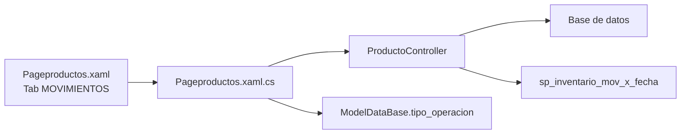
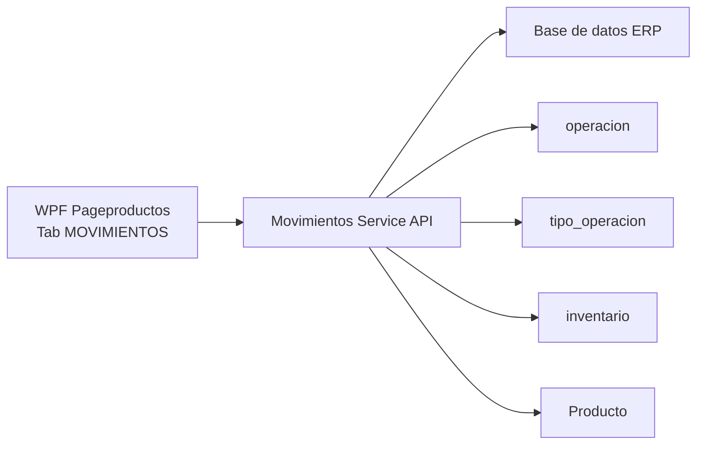
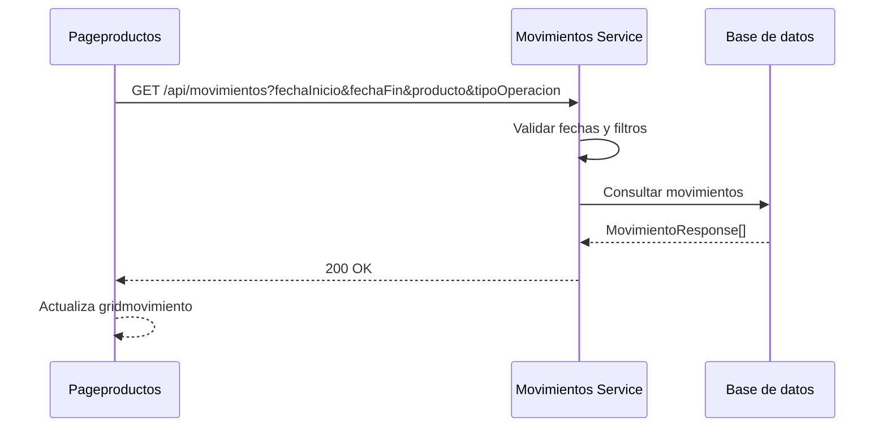

# Microservicio tab MOVIMIENTOS

Este documento separa la logica de la pestana `MOVIMIENTOS` de `Pageproductos.xaml` en una propuesta de microservicio.

- UI: `Erp/ErpSistem/INVENTARIO/Pageproductos.xaml`
- Code-behind: `Erp/ErpSistem/INVENTARIO/Pageproductos.xaml.cs`
- Controlador actual: `Erp/Controller/ProductoController.cs`
- DTO principal: `Erp/DTO/MovimientoDTO.cs`
- Entidad base: `Erp/Model/operacion.cs`
- Catalogo relacionado: `Erp/Model/tipo_operacion.cs`

## Objetivo

Centralizar la consulta de movimientos de inventario para que la pestana `MOVIMIENTOS` consuma una API de historial en vez de llamar directo a `ProductoController`.

El microservicio debe cubrir:

- Consulta de movimientos por rango de fechas.
- Filtro por producto/SKU/texto.
- Filtro por tipo de movimiento.
- Entrega de datos listos para `gridmovimiento`.
- Catalogo de tipos de operacion.

## Contexto actual



## Arquitectura propuesta



## Endpoints propuestos

Base path sugerido: `/api/movimientos`

| Metodo | Ruta | Uso en pantalla | Equivalente actual |
| --- | --- | --- | --- |
| `GET` | `/api/movimientos` | Consultar movimientos filtrados | `getMovimientoxfecha()` |
| `GET` | `/api/movimientos/tipos` | Cargar `cbx_tipo_mov` | `cargarTipoOperacion()` |

Parametros sugeridos para `GET /api/movimientos`:

| Parametro | Descripcion |
| --- | --- |
| `fechaInicio` | Fecha inicial del filtro. |
| `fechaFin` | Fecha final del filtro. |
| `producto` | SKU, nombre o texto de producto. |
| `tipoOperacion` | Id del tipo de operacion. |

## Contratos

### MovimientoResponse

```json
{
  "id": 501,
  "fechaHora": "2026-06-01T10:30:00",
  "codPro": 123,
  "nombrePro": "MARTILLO",
  "movimiento": "INGRESO DE STOCK",
  "cantidad": "3",
  "ubicacion": "BODEGA CENTRAL",
  "stockAnt": "20",
  "stockAct": "23",
  "movColor": "#DFF0D8",
  "destino": null
}
```

### TipoOperacionResponse

```json
{
  "idtipoOperacion": 2,
  "nombre": "INGRESO DE STOCK",
  "color": "#DFF0D8"
}
```

## Reglas de negocio

| Regla | Detalle |
| --- | --- |
| Fechas obligatorias | La consulta debe recibir fecha inicio y fecha fin. |
| Fecha fin valida | `fechaFin` debe ser mayor o igual que `fechaInicio`. |
| Tipo opcional | Si el tipo es `0` o vacio, debe traer todos los tipos. |
| Producto opcional | Si producto viene vacio, debe consultar sin filtro por producto. |
| Solo lectura | Este microservicio no registra movimientos; solo consulta historial. |

## Persistencia

### Tabla operacion

| Campo | Uso |
| --- | --- |
| `idoperacion` | Id mostrado en grilla. |
| `fecha_hora` | Fecha/hora del movimiento. |
| `idtipo_operacion` | Tipo de movimiento. |
| `idinventario` | Inventario afectado. |
| `cantidad` | Cantidad movida. |
| `idproducto` / `idingrediente` | Producto o ingrediente afectado. |
| `stock_ant` | Stock anterior. |
| `stock_act` | Stock actual. |
| `idtrans_bodega` | Transferencia asociada, si existe. |

### Tabla tipo_operacion

| Campo | Uso |
| --- | --- |
| `idtipo_operacion` | Valor del combo y filtro. |
| `nombre` | Texto mostrado. |
| `color` | Color usado en la grilla. |

## Flujo consulta movimientos



## Codigos de respuesta sugeridos

| Caso | Codigo HTTP | Respuesta |
| --- | --- | --- |
| Consulta correcta | `200 OK` | `MovimientoResponse[]` |
| Tipos cargados | `200 OK` | `TipoOperacionResponse[]` |
| Fechas invalidas | `400 Bad Request` | Detalle de validacion |

## Mapeo desde codigo actual

| Actual | Microservicio |
| --- | --- |
| `ProductoController.getMovimiento` | `GET /api/movimientos` sin filtros |
| `ProductoController.getMovimientoxfecha` | `GET /api/movimientos` con filtros |
| `Pageproductos.cargarTipoOperacion` | `GET /api/movimientos/tipos` |
| `btn_buscar_Click` | Llamada a `GET /api/movimientos` |

## Pendientes para implementacion

- Reemplazar el stored procedure o encapsularlo dentro del servicio.
- Definir paginacion si la tabla `operacion` crece mucho.
- Normalizar nombres JSON (`fecha_hora` a `fechaHora`, `stock_ant` a `stockAnt`).
- Agregar pruebas para filtros por fecha, producto, tipo y combinaciones vacias.
