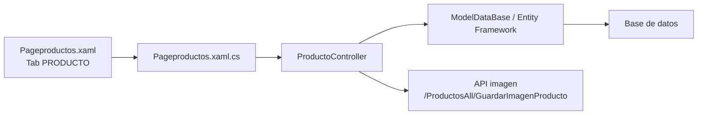
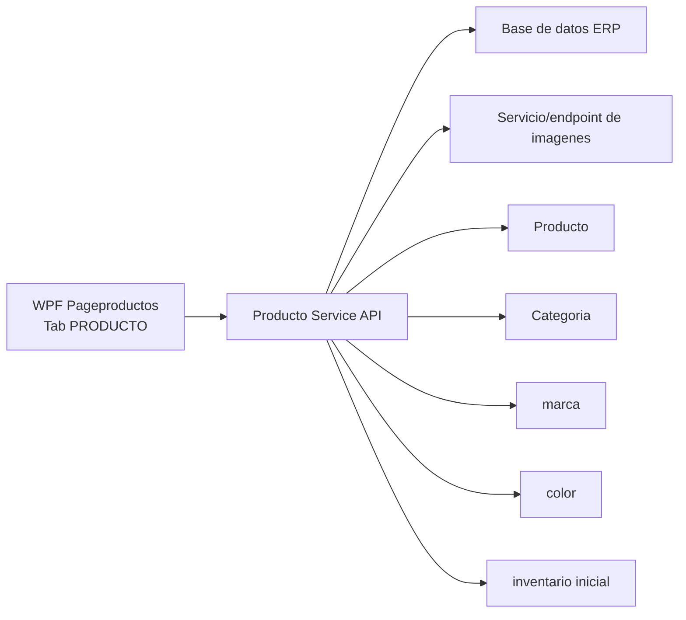
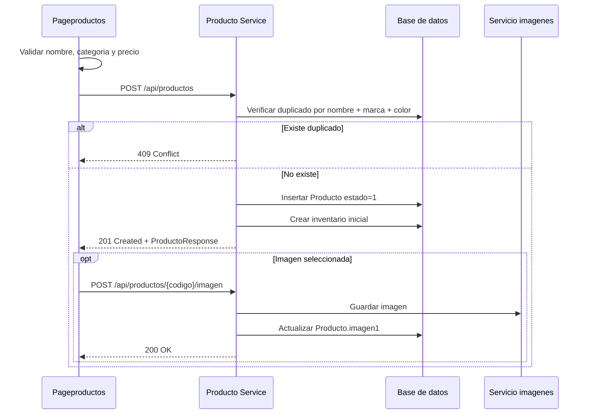
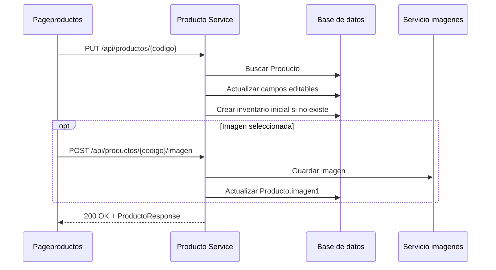

# Microservicio tab PRODUCTO

Este documento separa la logica de la pestana `PRODUCTO` de `Pageproductos.xaml` en una propuesta de microservicio. La pantalla actual vive en:

- UI: `Erp/ErpSistem/INVENTARIO/Pageproductos.xaml`
- Code-behind: `Erp/ErpSistem/INVENTARIO/Pageproductos.xaml.cs`
- Controlador actual: `Erp/Controller/ProductoController.cs`
- DTO principal: `Erp/DTO/productoDTO.cs`
- Entidad principal: `Erp/Model/Producto.cs`

## Objetivo

Centralizar la administracion de productos para que la pantalla `PRODUCTO` consuma una API en vez de acceder directamente a `ProductoController`/Entity Framework desde la aplicacion WPF.

El microservicio debe cubrir:

- Listado de productos con categoria, marca, color, precio, costo, utilidad, estado e imagen.
- Creacion de productos.
- Edicion de productos.
- Activacion/desactivacion de productos.
- Eliminacion controlada de productos.
- Carga y asociacion de imagen de producto.
- Consulta de categorias activas para el formulario.
- Consulta/creacion de marcas y colores usados por el formulario.

## Contexto actual



## Arquitectura propuesta



## Responsabilidades del microservicio

| Responsabilidad | Descripcion |
| --- | --- |
| Catalogo de productos | Mantiene los datos comerciales del producto. |
| Busqueda/listado | Entrega la grilla de la pestana `PRODUCTO`. |
| Validacion de duplicados | Evita crear productos con misma combinacion de nombre, marca y color. |
| Inventario inicial | Al crear un producto, genera inventario inicial en centro `1`, medida `3`, stock `0`. |
| Imagen de producto | Recibe la imagen y la guarda/asocia al producto. |
| Estado | Permite activar/desactivar el producto sin eliminarlo. |
| Eliminacion | Elimina solo si el producto no tiene detalle de pedido asociado. |

## Endpoints propuestos

Base path sugerido: `/api/productos`

| Metodo | Ruta | Uso en pantalla | Equivalente actual |
| --- | --- | --- | --- |
| `GET` | `/api/productos` | Cargar grilla completa | `getGrillaProductos(null)` |
| `GET` | `/api/productos?categoria={id}` | Filtrar grilla por categoria | `getGrillaProductos(codigo)` |
| `GET` | `/api/productos/{codigo}` | Obtener producto por codigo | `getProductoXcodigo(codigo)` |
| `GET` | `/api/productos/buscar?texto={texto}` | Busqueda por texto/EAN | `getFiltroProducto(texto)` o filtro local |
| `POST` | `/api/productos` | Agregar producto | `guardarProducto(productoDTO, image)` |
| `PUT` | `/api/productos/{codigo}` | Guardar edicion | `EditProducto(productoDTO, image)` |
| `PATCH` | `/api/productos/{codigo}/estado` | Activar/desactivar | `btn_estado_producto_Click` |
| `DELETE` | `/api/productos/{codigo}` | Eliminar producto | `RemoveProducto(codigo)` |
| `POST` | `/api/productos/{codigo}/imagen` | Subir imagen | `guardarImagenAsync(idproducto, imagen)` |
| `GET` | `/api/productos/categorias` | Combo categoria | `getCategorias()` |
| `GET` | `/api/productos/marcas` | Combo marca | `model.marca.ToList()` |
| `POST` | `/api/productos/marcas` | Crear marca | `ModalItem("Ingrese marca")` |
| `GET` | `/api/productos/colores` | Combo color | `model.color.ToList()` |
| `POST` | `/api/productos/colores` | Crear color | `ModalItem("Ingrese color")` |

## Contratos

### ProductoResponse

```json
{
  "codigo": 123,
  "nombre": "MARTILLO",
  "categoria": 4,
  "nameCategoria": "HERRAMIENTAS",
  "ean": "7800000000000",
  "idmarca": 2,
  "marca": "STANLEY",
  "idcolor": 5,
  "color": "AMARILLO",
  "precio": 12990,
  "precioCosto": 8500,
  "utilidad": 4490,
  "estado": 1,
  "descripcion": "Martillo carpintero",
  "lote": "L-001",
  "imagenRuta": "https://api.example.com/imagenes/productos/123.jpg"
}
```

### CrearProductoRequest

```json
{
  "nombre": "MARTILLO",
  "categoria": 4,
  "ean": "7800000000000",
  "idmarca": 2,
  "idcolor": 5,
  "precio": 12990,
  "precioCosto": 8500,
  "descripcion": "Martillo carpintero",
  "lote": "L-001"
}
```

La imagen puede enviarse en un segundo request a `/api/productos/{codigo}/imagen` o en el mismo `POST /api/productos` usando `multipart/form-data`.

### ActualizarProductoRequest

```json
{
  "nombre": "MARTILLO 16 OZ",
  "categoria": 4,
  "ean": "7800000000000",
  "idmarca": 2,
  "idcolor": 5,
  "precio": 13990,
  "precioCosto": 9000,
  "descripcion": "Martillo carpintero 16 oz",
  "lote": "L-001"
}
```

### CambiarEstadoRequest

```json
{
  "estado": 1
}
```

## Reglas de negocio

| Regla | Detalle |
| --- | --- |
| Nombre obligatorio | La UI actual marca error si `tb_nombre` esta vacio. |
| Categoria obligatoria | Debe existir una categoria seleccionada distinta de `0`. |
| Precio obligatorio numerico | La UI actual exige que `tb_precio` sea entero. |
| Producto duplicado | No se crea si ya existe un producto con mismo `nombre`, `idmarca` e `idcolor`. |
| Nombre en mayuscula | En creacion se guarda `producto.nombre.ToUpper()`. |
| Estado inicial | Al crear, `estado = 1`. |
| Inventario inicial | Al crear, se agrega registro en `inventario` con `idcentro = 1`, `idmedida = 3`, `stock_total = 0`, `stock_minimo = 0`. |
| Imagen opcional | Si no hay imagen, no se llama al guardado de imagen. |
| Eliminacion protegida | Si existe `Detalle_pedido` asociado, no se elimina. |
| Utilidad | Se calcula como `precio - precio_costo` cuando `precio_costo` existe. |

## Persistencia

### Tabla Producto

Campos usados por la pestana:

| Campo | Tipo logico | Uso |
| --- | --- | --- |
| `codigo` | int | Identificador/SKU interno. |
| `nombre` | string | Nombre del producto. |
| `categoria_codigo` | int? | Categoria seleccionada. |
| `precio` | int? | Precio de venta. |
| `precio_costo` | int? | Precio costo visible segun rol. |
| `estado` | int? | Activo `1`, inactivo `0`. |
| `idmarca` | int? | Marca seleccionada. |
| `idcolor` | int? | Color seleccionado. |
| `ean_codigo` | string | Codigo EAN. |
| `descripcion` | string | Descripcion corta. |
| `lote` | string | Lote. |
| `imagen1` | string | Ruta devuelta por el servicio de imagenes. |

### Tablas relacionadas

| Tabla | Uso |
| --- | --- |
| `Categoria` | Combo de categorias activas y nombre en grilla. |
| `marca` | Combo de marcas y nombre en grilla. |
| `color` | Combo de colores y nombre en grilla. |
| `inventario` | Registro inicial de stock al crear producto. |
| `Detalle_pedido` | Validacion antes de eliminar producto. |

## Flujo crear producto



## Flujo editar producto



## Codigos de respuesta sugeridos

| Caso | Codigo HTTP | Respuesta |
| --- | --- | --- |
| Producto creado | `201 Created` | `ProductoResponse` |
| Producto actualizado | `200 OK` | `ProductoResponse` |
| Producto sin cambios | `200 OK` | `ProductoResponse` o mensaje informativo |
| Producto duplicado | `409 Conflict` | `{ "message": "Producto existente" }` |
| Producto no encontrado | `404 Not Found` | `{ "message": "Producto no encontrado" }` |
| Validacion fallida | `400 Bad Request` | Detalle de campos invalidos |
| Producto usado en pedido | `409 Conflict` | `{ "message": "Producto utilizado" }` |
| Imagen subida | `200 OK` | Ruta de imagen |

## Mapeo desde codigo actual

| Actual | Microservicio |
| --- | --- |
| `ProductoController.getGrillaProductos` | `GET /api/productos` |
| `ProductoController.getCategorias` | `GET /api/productos/categorias` |
| `Pageproductos.cargarMarca` | `GET /api/productos/marcas` |
| `Pageproductos.cargarColor` | `GET /api/productos/colores` |
| `ProductoController.guardarProducto` | `POST /api/productos` |
| `ProductoController.EditProducto` | `PUT /api/productos/{codigo}` |
| `ProductoController.guardarImagenAsync` | `POST /api/productos/{codigo}/imagen` |
| `Pageproductos.btn_estado_producto_Click` | `PATCH /api/productos/{codigo}/estado` |
| `ProductoController.RemoveProducto` | `DELETE /api/productos/{codigo}` |

## Configuracion

Variables/valores que deberian salir del codigo y quedar configurables:

| Configuracion | Uso actual |
| --- | --- |
| `ApiBaseUrl` | Base URL para imagenes y construccion de `ImagenRuta`. |
| `ImageApiKey` | Header `ApiKey` usado al subir imagen. |
| `DefaultCentroId` | Valor actual fijo `1` para inventario inicial. |
| `DefaultMedidaId` | Valor actual fijo `3` para inventario inicial. |

## Pendientes para implementacion

- Definir si la imagen se sube junto con el producto o en endpoint separado.
- Mover la busqueda por texto desde filtro local de WPF a `GET /api/productos/buscar`.
- Normalizar nombres de campos entre C# (`precio_costo`, `ImagenRuta`) y JSON (`precioCosto`, `imagenRuta`).
- Validar duplicado usando mayusculas/normalizacion para evitar diferencias por capitalizacion.
- Corregir manejo de errores para no ocultar excepciones con `catch` vacios.
- Evitar que la API key de imagen quede hardcodeada.
- Agregar pruebas de creacion, duplicado, edicion, cambio de estado y eliminacion protegida.
