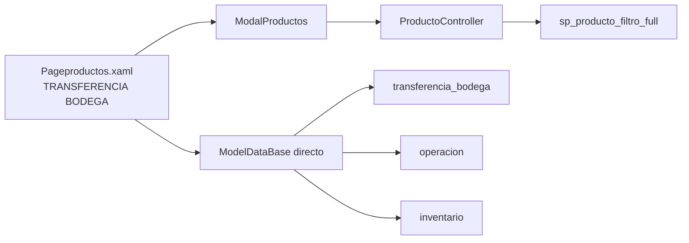
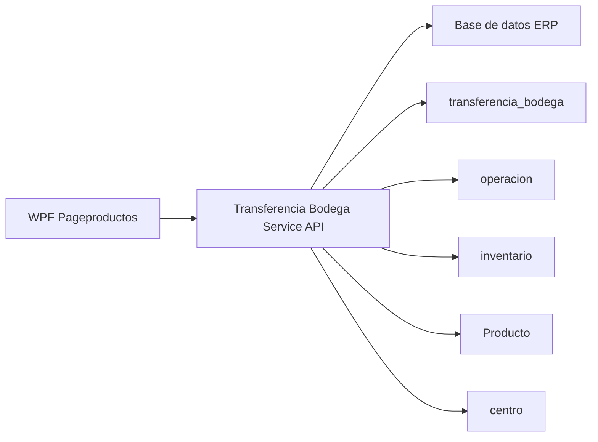
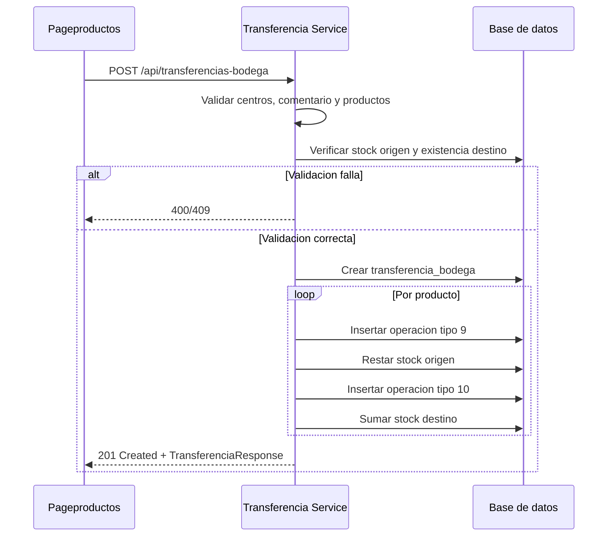
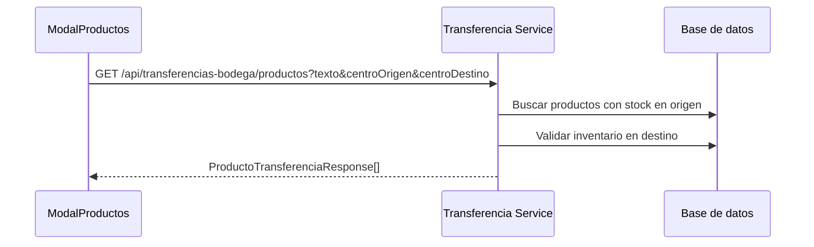

# Microservicio tab TRANSFERENCIA BODEGA

Este documento separa la logica de la pestana `TRANSFERENCIA BODEGA` de `Pageproductos.xaml` en una propuesta de microservicio.

- UI: `Erp/ErpSistem/INVENTARIO/Pageproductos.xaml`
- Code-behind: `Erp/ErpSistem/INVENTARIO/Pageproductos.xaml.cs`
- Modal relacionado: `Erp/ErpSistem/INVENTARIO/ModalProductos.xaml`
- Entidad principal: `Erp/Model/transferencia_bodega.cs`
- Entidad de movimientos: `Erp/Model/operacion.cs`
- DTO de productos seleccionados: `Erp/DTO/DetalleDTO.cs`

## Objetivo

Centralizar la transferencia de stock entre bodegas/centros para que la pantalla consuma una API transaccional en vez de crear `transferencia_bodega`, `operacion` y actualizaciones de stock directamente desde WPF.

El microservicio debe cubrir:

- Consulta de centros origen/destino.
- Busqueda de productos con stock en centro origen.
- Validacion de existencia del producto en centro destino.
- Creacion de transferencia de bodega.
- Registro de salida de stock en origen.
- Registro de entrada de stock en destino.
- Actualizacion atomica de stocks.
- Generacion opcional de ticket de transferencia.

## Contexto actual



## Arquitectura propuesta



## Endpoints propuestos

Base path sugerido: `/api/transferencias-bodega`

| Metodo | Ruta | Uso en pantalla | Equivalente actual |
| --- | --- | --- | --- |
| `GET` | `/api/transferencias-bodega/centros` | Cargar origen/destino | `GetCentros()` |
| `GET` | `/api/transferencias-bodega/productos` | Buscar productos origen | `getFiltroProductoFull(texto, idcentro)` |
| `POST` | `/api/transferencias-bodega/validar-producto-destino` | Validar existencia destino | Consulta directa en `ModalProductos` |
| `POST` | `/api/transferencias-bodega` | Realizar transferencia | `RealizarTransferencia_Click()` |
| `GET` | `/api/transferencias-bodega/{id}` | Obtener transferencia | Nuevo endpoint sugerido |
| `GET` | `/api/transferencias-bodega/{id}/ticket` | Generar ticket | `PrintTicketTransferencia()` |

Parametros sugeridos para buscar productos:

| Parametro | Descripcion |
| --- | --- |
| `texto` | Texto, SKU o EAN buscado. |
| `centroOrigen` | Centro desde donde saldra el stock. |
| `centroDestino` | Centro usado para validar existencia destino. |

## Contratos

### ProductoTransferenciaResponse

```json
{
  "codigo": 123,
  "producto": "MARTILLO",
  "ean": "7800000000000",
  "stock": 20,
  "idinventario": 10,
  "idmedida": 3,
  "centro": "BODEGA CENTRAL"
}
```

### CrearTransferenciaRequest

```json
{
  "idCentroDesde": 1,
  "idCentroHasta": 2,
  "comentario": "Reposicion sala de ventas",
  "loginUserRevisa": 7,
  "productos": [
    {
      "codigo": 123,
      "idInventarioOrigen": 10,
      "cantidad": 3
    }
  ]
}
```

### TransferenciaResponse

```json
{
  "idTransferencia": 55,
  "idCentroDesde": 1,
  "idCentroHasta": 2,
  "comentario": "Reposicion sala de ventas",
  "loginUserRevisa": 7,
  "fechaRevision": "2026-06-01T11:00:00",
  "productos": [
    {
      "codigo": 123,
      "producto": "MARTILLO",
      "cantidad": 3,
      "stockOrigenAnterior": 20,
      "stockOrigenActual": 17,
      "stockDestinoAnterior": 5,
      "stockDestinoActual": 8
    }
  ]
}
```

### TicketTransferenciaResponse

```json
{
  "idTransferencia": 55,
  "ticket": "FERRETERIA SAN ALFONSO\nTRANSFERENCIA BODEGA\n..."
}
```

## Reglas de negocio

| Regla | Detalle |
| --- | --- |
| Centro origen obligatorio | Debe seleccionarse `idCentroDesde`. |
| Centro destino obligatorio | Debe seleccionarse `idCentroHasta`. |
| Centros distintos | Origen y destino no pueden ser iguales. |
| Productos obligatorios | La transferencia requiere al menos un producto. |
| Comentario obligatorio | La UI actual exige `tbx_comentario`. |
| Stock suficiente | La cantidad debe ser menor o igual al stock disponible del origen. |
| Existencia en destino | El producto debe tener registro de inventario en el centro destino. |
| Salida origen | Por cada producto se registra `operacion.idtipo_operacion = 9`. |
| Entrada destino | Por cada producto se registra `operacion.idtipo_operacion = 10`. |
| Stock atomico | Crear transferencia, movimientos y actualizar stocks debe ser una sola transaccion. |

## Persistencia

### Tabla transferencia_bodega

| Campo | Uso |
| --- | --- |
| `idtrans_bodega` | Id de transferencia. |
| `idcentrodesde` | Centro origen. |
| `idcentrohasta` | Centro destino. |
| `descripcion` | Comentario. |
| `login_user_revisa` | Usuario que realiza/revisa la transferencia. |
| `fecharevision` | Fecha de creacion. |
| `login_user_autoriza` | Usuario autorizador, si aplica. |
| `fechaautorizacion` | Fecha de autorizacion, si aplica. |

### Tabla operacion

| Campo | Uso |
| --- | --- |
| `idtipo_operacion` | `9` salida origen, `10` entrada destino. |
| `idinventario` | Registro de inventario afectado. |
| `idproducto` | Producto transferido. |
| `cantidad` | Cantidad transferida. |
| `stock_ant` | Stock anterior. |
| `stock_act` | Stock posterior. |
| `idtrans_bodega` | Relacion con la transferencia. |

## Flujo realizar transferencia



## Flujo buscar producto para transferencia



## Codigos de respuesta sugeridos

| Caso | Codigo HTTP | Respuesta |
| --- | --- | --- |
| Transferencia creada | `201 Created` | `TransferenciaResponse` |
| Productos encontrados | `200 OK` | `ProductoTransferenciaResponse[]` |
| Ticket generado | `200 OK` | `TicketTransferenciaResponse` |
| Validacion fallida | `400 Bad Request` | Detalle de campos invalidos |
| Stock insuficiente | `409 Conflict` | `{ "message": "La cantidad debe ser menor al stock" }` |
| Producto no existe en destino | `409 Conflict` | Mensaje con producto y centro destino |

## Mapeo desde codigo actual

| Actual | Microservicio |
| --- | --- |
| `ProductoController.GetCentros` | `GET /api/transferencias-bodega/centros` |
| `ModalProductos.txt_filtro_pro_KeyUp` | `GET /api/transferencias-bodega/productos` |
| Consulta destino en `ModalProductos.btn_agregarPro_Click` | Validacion dentro del endpoint de productos o transferencia |
| `Pageproductos.CrearTransferencia` | Parte de `POST /api/transferencias-bodega` |
| `RealizarTransferencia_Click` | `POST /api/transferencias-bodega` |
| `actualizarStockInv` | Parte transaccional del endpoint |
| `PrintTicketTransferencia` | `GET /api/transferencias-bodega/{id}/ticket` |

## Configuracion

| Configuracion | Uso actual |
| --- | --- |
| `SalidaTransferenciaTipoOperacionId` | Valor actual `9`. |
| `EntradaTransferenciaTipoOperacionId` | Valor actual `10`. |
| `TicketNombreEmpresa` | Texto actual `FERRETERIA SAN ALFONSO`. |

## Pendientes para implementacion

- Envolver toda la transferencia en una transaccion de base de datos.
- Evitar `SaveChanges()` por cada operacion; guardar todo junto al confirmar.
- Revalidar stock en servidor justo antes de descontar.
- Definir si el ticket se imprime en cliente o si la API solo devuelve el texto.
- Normalizar cantidades para productos con unidades distintas de `UN`.
- Agregar pruebas para centros iguales, sin productos, sin comentario, stock insuficiente, producto inexistente en destino y transferencia correcta.
