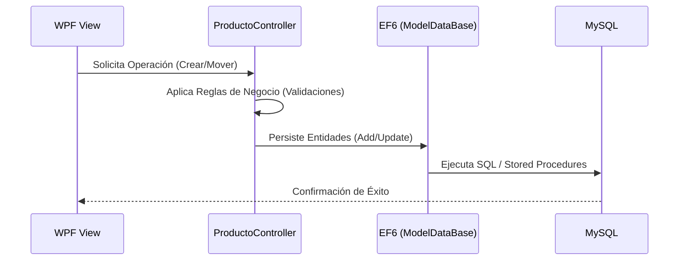

# Modelo de Negocio - Inventario y Productos

Este documento describe el modelo de negocio, las reglas operativas y el flujo de datos para la gestión de productos e inventario en el sistema ERP.

## 1. Entidades Principales

| Entidad | Descripción | Atributos Clave |
| --- | --- | --- |
| **Producto** | Catálogo comercial de artículos. | Nombre, Precio, EAN, Categoría, Marca, Color. |
| **Inventario** | Registro de existencias físicas por ubicación. | idProducto, idCentro (Bodega), StockTotal, StockMinimo. |
| **Operación** | Registro histórico de movimientos de stock. | idInventario, idTipoOperacion, Cantidad, StockAnt, StockAct. |
| **Transferencia** | Cabecera de movimientos entre bodegas. | CentroOrigen, CentroDestino, Comentario, Usuario. |

---

## 2. Módulo de Productos (Tab PRODUCTO)

### Reglas de Negocio
- **Creación**: Se requiere Nombre, Categoría y Precio. El nombre se guarda siempre en mayúsculas.
- **Validación de Duplicados**: No se permite crear un producto si ya existe la misma combinación de Nombre + Marca + Color.
- **Estado**: Los productos pueden ser Activados/Desactivados. Un producto desactivado no debería aparecer en la toma de pedidos.
- **Imágenes**: Se asocian imágenes al producto mediante un servicio externo. Al guardar, se almacena la ruta de la imagen.
- **Inventario Inicial**: Al crear un producto, se genera automáticamente un registro de inventario inicial en la Bodega Central (ID 1) con stock 0.
- **Eliminación**: Un producto solo puede eliminarse si no tiene registros asociados en `Detalle_pedido`.

---

## 3. Gestión de Existencias (Tab INVENTARIO)

### Reglas de Negocio
- **Unidad de Medida Especial**: Si la unidad de medida es 1 (ej: Granel/Kilos), el sistema maneja 3 decimales. Internamente, se multiplica la cantidad por 1000 para guardarla como entero.
- **Stock Mínimo**: Se utiliza para alertas visuales (color) cuando el `StockTotal` es menor o igual al `StockMinimo`.
- **Relación Bodega**: Un producto puede tener un registro de inventario independiente por cada bodega (Centro).

---

## 4. Historial de Movimientos (Tab MOVIMIENTOS)

### Tipos de Operación
1. **Ingreso (Tipo 2)**: Aumenta el `StockTotal` del inventario.
2. **Egreso (Tipo 3)**: Disminuye el `StockTotal`. No se permite que el stock final sea menor a cero.
3. **Salida por Transferencia (Tipo 9)**: Disminuye stock en el origen.
4. **Entrada por Transferencia (Tipo 10)**: Aumenta stock en el destino.

---

## 5. Transferencias de Bodega

### Proceso y Validaciones
- **Origen y Destino**: Deben ser centros diferentes.
- **Stock en Origen**: Se debe validar que el centro origen tenga existencias suficientes antes de iniciar la transferencia.
- **Existencia en Destino**: El producto debe estar previamente registrado en el catálogo de inventario del centro destino.
- **Atomicidad**: La transferencia genera dos movimientos por producto (Tipo 9 y Tipo 10). Se deben actualizar los stocks de ambos centros simultáneamente.
- **Documentación**: Cada transferencia genera un ticket impreso con el detalle de los productos y espacio para firma de recepción.

---

## 6. Flujo de Datos Arquitectónico

## 7. Consultas Especializadas (Stored Procedures)

El sistema utiliza procedimientos almacenados para búsquedas complejas:
- `sp_producto_filtro_full`: Búsqueda avanzada de productos con filtros de texto y stock.
- `sp_inventario_get`: Obtiene el estado actual del inventario global.
- `sp_inventario_mov_x_fecha`: Reporte histórico de movimientos filtrado por fechas.
